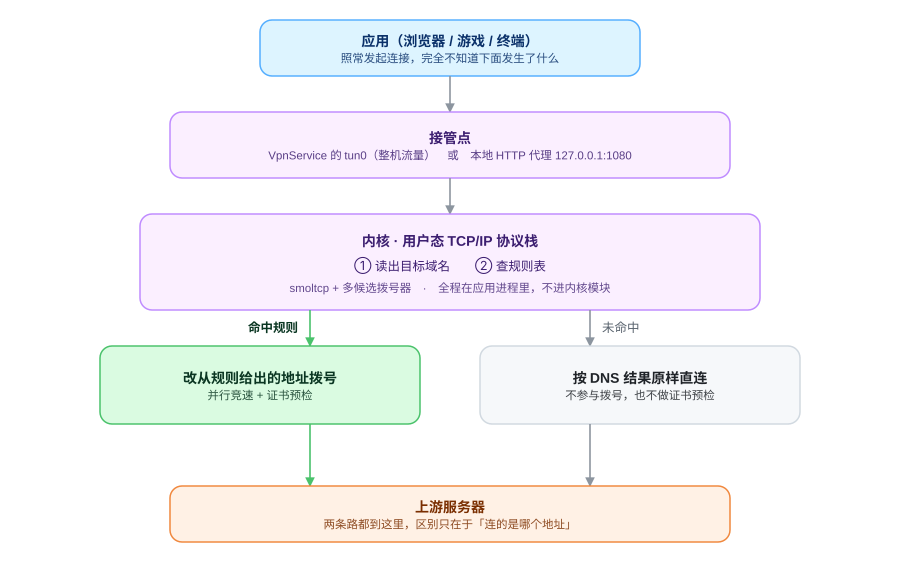
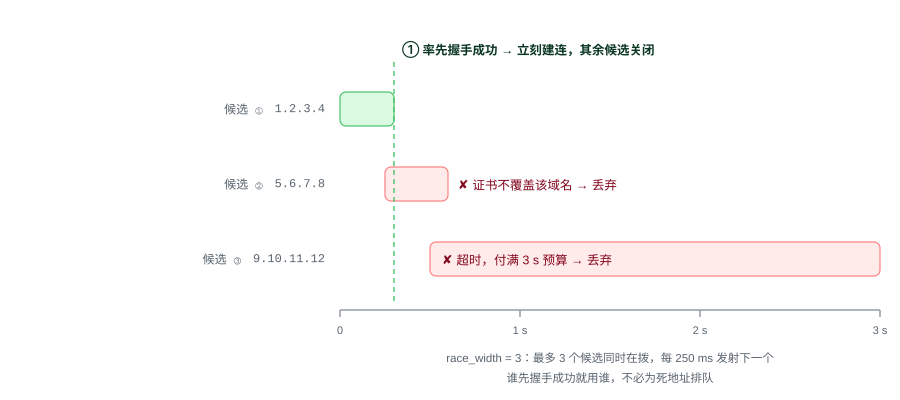
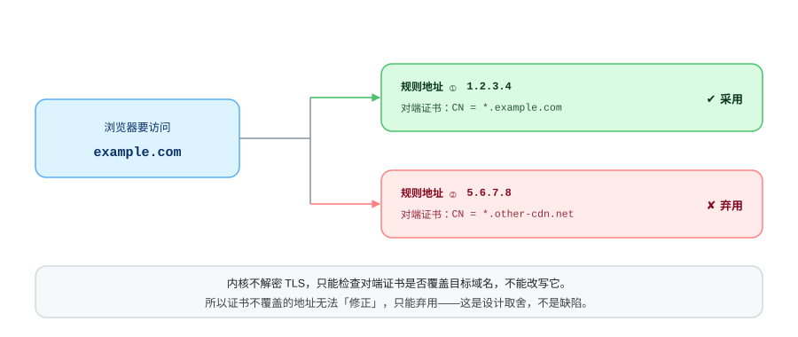
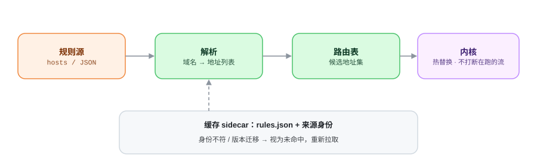

<div align="center">

# speed

**免 Root 的 Android 网络绕行工具**

规则表里命中的域名，改从规则给出的地址拨号；其余流量原样直连。

[](LICENSE)
[-3ddc84.svg)](#下载)
[](#下载)
[](../../releases/latest)

[下载](#下载) · [工作原理](#工作原理) · [设计取舍](#设计取舍) · [从源码构建](#从源码构建) · [免责声明](DISCLAIMER.md)

</div>

---

## 解决什么问题

有些服务在你的网络里连不上，原因不是服务本身不可用，而是**域名解析出来的那个地址**在你这里不通。
同一个服务通常在多个地址上都有入口，换一个地址就能连——问题只在于你不知道该换成哪个。

`speed` 就是补上这一步：它带一份「域名 → 已知可用地址」的规则表，
在系统把连接交出去之前截住它；域名在表里，就改从表里的地址拨号。

不需要 Root，不需要安装证书，不需要框架。

当前版本只有一种接管方式：**VPN 模式**——整机全部流量都交给 `speed`，需要一次系统 VPN 授权。

## 工作原理

<div align="center">
<picture>
<source media="(prefers-color-scheme: dark)" srcset="assets/flow-dark.svg">

</picture>
</div>

### 一次连接里发生了什么

1. 应用照常发起连接，目标是一个域名——它不知道下面发生了什么。
2. 系统把这条流量交给 `speed`：经 `VpnService` 的 `tun0` 接管整机。
3. 内核在**用户态**终止这条连接（自带一套 TCP/IP 协议栈），读出目标域名。
4. 查规则表：
   - **命中** → 不再理会系统 DNS 的结果，改从规则给出的地址里拨号；
   - **未命中** → 按系统 DNS 的结果原样直连，不参与拨号。
5. 两条路都通到上游服务器，区别只在于**连的是哪个地址**。

整个内核跑在应用进程里，不加载内核模块，不修改系统分区——这是「免 Root」的全部含义。

## 两个关键机制

### 多候选并行竞速

一个域名在规则表里往往有多个候选地址，但其中一部分是死的。如果逐个试，
排在可用地址**前面**的那个死地址会让这个域名白等一整个超时。

`speed` 改成同时开拨：同一时刻最多 `race_width` 个候选在拨，每 250 ms 再发射下一个，
谁先握手成功就用谁，其余立刻关闭。

<div align="center">
<picture>
<source media="(prefers-color-scheme: dark)" srcset="assets/race-dark.svg">

</picture>
</div>

最坏情况从「所有死地址的超时之和」压到「最快那个候选的握手时间」。
`race_width = 1` 就退回逐个串行尝试，和传统做法一样。

这套机制只在规则表**确实给出多个候选**时才有用。实测默认那份文档 40 条条目**每条都只有一个地址**，
此时并行无从展开，`race_width` 调多大都一样：一个死候选就等于这个域名必然失败。要让并行真正生效，
规则表得先给出第二个地址。

### 证书预检：地址能连，不等于地址是它

拨号之前，内核会先确认这个地址出示的证书是否覆盖目标域名。这一步是必需的：

<div align="center">
<picture>
<source media="(prefers-color-scheme: dark)" srcset="assets/cert-dark.svg">

</picture>
</div>

少了这一步，一个证书不匹配的地址会被当成可用地址用很久，失败会以一种难以归因的形式暴露出来。
应用提供「校验规则地址的证书」开关，关掉会快一些，但可能连到证书不对的地址。
这是有意的取舍：**宁可让调用方看见一个明确的失败，也不要给它一个看起来成功、实际连错机器的连接。**

## 规则从哪来

<div align="center">
<picture>
<source media="(prefers-color-scheme: dark)" srcset="assets/rules-dark.svg">

</picture>
</div>

- 默认源是 `HelloGitHub（GitHub520）`（[`521xueweihan/GitHub520`](https://github.com/521xueweihan/GitHub520) 的 hosts 文件），
  40 个域名，主地址 `raw.hellogithub.com` 在香港，实测延迟最低（0.10–0.12s）。
  两个风险用户必须知道：**服务器将于 2026-12-31 到期**，**许可为 CC BY-NC-ND 4.0（禁商用、禁演绎）**。
  镜像取的是同一份上游文档的另一个端点，所以主地址失效后文档仍取得到，但届时需要换掉主地址——镜像只是把
  「立刻不可用」降级成「降速可用」。应用只按 URL 在运行时引用该文档，不打包进安装包。
- 第二个可选源是 `github-hosts`（[`maxiaof/github-hosts`](https://github.com/maxiaof/github-hosts) 的 hosts 文件），
  经国内可达的镜像获取：GitHub 的 IPv4 在大陆不可达，而 Android 的 `HttpURLConnection` 不会回落 IPv6，
  直连对国内用户必然失败。主地址走反代，另有 jsDelivr 与上游直连两个备选依次回退。
- 默认源在你的网络下不可达时，在规则页切换其他源或添加自定义源即可。
- 三级下钻：**分组 → 域名 → 地址**；搜索覆盖域名、地址与分组名。
- 分组级开关，以及全部开启 / 全部关闭；被关掉的规则不会进入内核。
- 规则热替换不打断正在传输的连接。

**缓存记录的是「它是哪一套规则」，不只是「它有多旧」。**
缓存此前只按时间判有效，于是换了数据源或升级应用之后，一套形状完全不同的旧规则会被继续使用——
界面显示规则正常，实际所有站点都在直连。现在缓存同时记下来源身份，身份不符即视为未命中并重新拉取。

## 界面

三个页面：

- **连接** —— 总开关、实时上下行速率、本次会话流量与命中率、规则缓存新鲜度。
- **规则** —— 分组 → 域名 → 地址三级下钻，搜索覆盖域名 / 地址 / 分组名，分组级开关与全开 / 全关。
- **设置** —— 内核参数、规则源、外观（玻璃材质 / 主题色 / 深色模式 / 圆角 / 字号）、
  数据导出导入、日志、关于与更新检查。

界面截图不随仓库分发：它们会随本机的壁纸、规则规模与语言设置变化，
放一张在仓库里，除了过时没有别的前途。

## 特性

- **路由** —— 规则驱动改道 · 多候选并行竞速 · 证书预检 · 失败冷却与排序 · 命中时 DNS 本地应答 · UDP 流表满时淘汰最久未用 · 规则热替换
- **规则** —— 三级下钻与搜索 · 分组开关 · 自定义规则源 · 缓存来源身份校验
- **观测** —— 实时速率与命中率 · 实时 / 归档日志与过滤导出 · 开发者视图（候选地址、冷却、静默计数）· 内核命令行
- **数据** —— 设置导出 / 导入（JSON 文档，导入前二次确认，来自更新版本的文档会被拒绝）
- **更新** —— 默认指向本仓库 Releases（经 `gh-proxy.com` 反代，因为应用自身流量不走自己的隧道）· 启动时静默检查，每天最多一次且可关 · 有新版弹窗并内联更新日志 · 按设备 ABI 挑下载包
- **外观** —— 玻璃材质（折射与模糊合并为一个开关）与自定义壁纸 · 主题色 / 深色模式 / 圆角 / 字号

几个值得单独说的点：

- **失败分三类归因**：连接被拒 / 超时 / 「连上但零字节」。第三类只降低排序，不写失败记录——它是服务器侧的静默，不代表地址坏了。**不用启发式去猜**，因为「连上但零字节」可测，而证书不匹配不可测（服务器先发证书、客户端才拒绝，双向都有字节）。
- **超时按语义拆分**：没有备选地址时给足预算，有备选地址时用一个短窗口快速试错。一个死候选等于一次必然失败，因为预算是客户端给的。
- **内核命令行**：与 adb 控制面同一套命令（`status`、`set mtu 1400`、`dump`、`help`），直接在手机上驱动内核，不必连电脑。

## 设计取舍

**不解密 TLS。** 这是刻意的选择，不是缺失。应用不装证书、不做中间人，因此
「一个域名能不能走通」严格等于两件事同时成立：

1. 规则给出的地址**可达**；
2. 该地址出示的证书**覆盖这个域名**。

第二条是架构边界。规则表里一个地址再快，只要证书不覆盖目标域名就用不了它，只能换地址。
有些 CDN 的边缘证书覆盖范围很宽（例如 Akamai 边缘证书覆盖 `*.akamaihd.net`），这类域名可以正常走；
覆盖范围窄的，就只能靠规则表给出正确的地址。

**规则质量决定成败，但正确不等于可达。** 这套方案的实际瓶颈是规则表里地址的**正确性**，不是地址的数量。
而即便地址是对的，它能不能从当前网络连上，仍取决于那条路径——规则源提供的是**地址**，不是**可达性**。
把 IP 写进规则只跳过 DNS 解析，完全不改变这个 IP 通不通。

这一点最容易被误判成「规则源不可靠」。实测中默认源给 `github.com` 的地址与权威 DNS 的答案一字不差，
在隧道里稳定返回 200；而同一份文档里 `gist.github.com` 与 `github.global.ssl.fastly.net` 两条的地址
是死的，表现是**挂满超时之后再报「候选耗尽」**。这属于数据过期——换个源可能就好了，但它既不是
「权威源不可信」，也不是内核的缺陷。

**另有一类失败与地址无关：按名字的干扰。** 有些域名 TCP 能建连，TLS 却在客户端发出第一个记录之后
被静默——内核日志里表现为「上游已连接」紧跟零字节返回，而同一时刻同一地址上的其他十几个域名都正常。
实测 `raw.githubusercontent.com` 就是这样：两个内置源给的地址都试过，这一轮五十余次尝试里只成功了
两次，而它们指向的同一台服务器上，别的名字在同样几秒内 200/301 正常返回。**换地址救不了它，放宽证书校验
也救不了它**（去掉证书校验后失败形态一模一样），只有换一个出口才行。应用没有远端出口，这是定位，
不是缺口。

**连通性本身在分钟尺度上抖动。** 同一台设备、同一个域名、同一个地址，一组测量里通过率能在一刻钟内
从十之八九掉到十之一二，**连对照组一起掉**。所以任何「某域名通/不通」的结论都必须带上时间窗和对照组；
单次结果不是判据。

**不 Root。** 走 `VpnService` 而不是内核模块或 iptables，代价是接管点在内核之上、
拿不到原始套接字；换来的是不用刷机、不用 Root、不修改系统分区，卸载即完全还原。

### 已知限制

- 规则表里地址过期时，对应域名会失败或直连——这是数据问题，不是内核问题。
- 地址过期的一种具体表现：挂满超时之后报「候选耗尽」。若该条目只有一个地址，就没有第二条路可走。
- 被按名字干扰的域名（TCP 通、TLS 第一个记录之后被静默）无法处理：换地址无效，放宽证书校验也无效。
- 不解密 TLS 意味着无法处理「所有已知地址的证书都不覆盖该域名」的情况。
- 连通性在分钟尺度上抖动，通过率会随时间窗大幅变化。这不是内核状态，日志里的失败计数要连着时间窗一起看。
- 最低 Android 8.0（API 26）。

## 下载

到 [Releases](../../releases) 下载对应 ABI 的 APK：

| 文件 | 适用设备 |
| --- | --- |
| `speed-<版本>-arm64-v8a.apk` | 绝大多数现代手机与平板 |
| `speed-<版本>-x86_64.apk` | 模拟器、少数 x86 平板 |

两个包用**同一个发布密钥**签名。密钥不在仓库里——一个会安装 VPN 的应用，
「谁能签出构建」就是它的信任边界，所以密钥由维护者保管，经仓库 secret 交给 CI。
若签名与你已装的版本不一致，Android 会拒绝覆盖安装；先卸载再装。

应用启动时会自己查一次有没有新版（每天最多一次，可在关于页关掉），有新版会弹出窗口并附上
这个版本的更新日志，并直接给你对应 ABI 的下载链接——不必盯着 Releases 页面。

**更新检查与 APK 下载都经 `gh-proxy.com` 这一第三方镜像中转，不走直连。** 这不是偏好，
是可达性要求：应用自身流量被刻意排除在隧道之外（`addDisallowedApplication`，防自环），
所以更新走的是裸网络，而 GitHub 在部分网络环境下直连不可达。

**下载这一跳也走镜像，理由是「少一跳」，不是「否则下不下来」。** 与查版本不同，下载要经过一次重定向：
`github.com/.../releases/download/...` 返回 **302** 到 `release-assets.githubusercontent.com`。
这个名字**不在规则文档里**（表里只有**旧的** `objects.githubusercontent.com`），所以隧道对它的处置是
**直连**（见「设计取舍」）——即下载能否成功取决于该域名当前解析到的**真实地址**在当前网络是否可达，
而不取决于规则表。经镜像后整条重定向链在代理侧被消化，客户端只连镜像一个域名。

**实测（设备、经 tun0）：两条路当前都通，各取回 64 KB（`206` + `application/vnd.android.package-archive`），
同一窗口背靠背 4 轮无失败，耗时差落在噪声内**——对照域名自身在 0.37–6.70s 之间波动，相差 18 倍，
所以「镜像更快」这一条**测不出来，不作为理由**。改动的实际依据是：少一次重定向、少一个对第三方
解析地址可达性的依赖、以及和查版本保持同一套语义。

中转意味着**你的下载请求会经过第三方**。完整性由 **APK 签名**兜底——被改过的包装不上，
但这不保证第三方不记录下载行为。不接受第三方中转的话，请从源码自行构建（见下一节）。
若 Releases 页面本身也打不开，用 `https://gh-proxy.com/https://github.com/zejiahuang/speed/releases`。

## 从源码构建

需要：Rust（含 `aarch64-linux-android` 与 `x86_64-linux-android` target）、
Android NDK r30、Android SDK（platform 36 + build-tools 36.0.0）、JDK 17。

两条命令就够了：

```bash
bash scripts/app-native-build.sh aarch64-linux-android x86_64-linux-android
SKIP_NATIVE=1 bash scripts/app-build.sh assembleRelease -PabiSplits
```

这两个脚本是薄封装，CI 用的就是它们。下面把脚本里做的事摊开写一遍——出问题时
（NDK 链接器选错、`--manifest-path` 漏了、ABI 与目录名对不上、Gradle 从哪来）
才知道该动哪一层，不想跑脚本的人也可以逐步核对。

**仓库里没有 Gradle wrapper，也没有 `gradlew`。** 一个仓库里放一份没人能重新生成的二进制
比一次下载更糟，所以 Gradle 发行包自己取（`scripts/app-build.sh` 首次运行也会取到同一个地方）：

```bash
GRADLE_VERSION=8.14.3
curl -fsSL -o /tmp/gradle.zip \
  "https://services.gradle.org/distributions/gradle-${GRADLE_VERSION}-bin.zip"
unzip -q /tmp/gradle.zip -d ~/.cache                      # -> ~/.cache/gradle-8.14.3
export PATH="$HOME/.cache/gradle-${GRADLE_VERSION}/bin:$PATH"
```

### 1) 编译内核：Rust → `.so`

Cargo 对 Android target 没有默认链接器，必须显式指到 NDK 的 clang。
只给 `--target` 会用主机的 `cc` 去链接，在 arm64 上报 `Relocations in generic ELF (EM: 183)`。

下面两段都在**仓库根目录**执行：

```bash
NDK=$HOME/android/android-ndk-r30
TOOLCHAIN=$NDK/toolchains/llvm/prebuilt/linux-x86_64
API=34                       # NDK 的 clang wrapper 按 API 级别分档
export CARGO_TARGET_DIR=$HOME/.cache/watt-target

# `watt-ffi` 的 crate-type 含 `staticlib`，归档静态库时会调 ar。指到 NDK 那一份，
# 免得用主机的 GNU ar 去归档 Android 的目标文件（通常能过，但那是运气不是保证）。
export AR=$TOOLCHAIN/bin/llvm-ar

build_abi() {
  abi=$1; dir=$2
  # 变量名里的 ABI 要全大写、`-` 换成 `_`，否则 cargo 读不到这个设置。
  export "CARGO_TARGET_$(echo "$abi" | tr 'a-z-' 'A-Z_')_LINKER=$TOOLCHAIN/bin/${abi}${API}-clang"

  # `--manifest-path` 不能省：仓库根目录没有 Cargo.toml，workspace 在 core-rs/ 下，
  # 而下面的 cp 目标又是相对仓库根的。这样两边都在同一个 cwd 里，不必来回 cd。
  #
  # `jni-bridge` 才生成 JNI 入口点（Java_dev_detour_core_Kernel_*）。
  # 少了它 System.loadLibrary 照样成功，但每次调用都抛 UnsatisfiedLinkError。
  cargo build -p watt-ffi --features jni-bridge --release \
    --target "$abi" --manifest-path core-rs/Cargo.toml

  mkdir -p "android/app/src/main/jniLibs/$dir"
  cp "$CARGO_TARGET_DIR/$abi/release/libwatt_ffi.so" "android/app/src/main/jniLibs/$dir/"
}

build_abi aarch64-linux-android arm64-v8a
build_abi x86_64-linux-android  x86_64
```

注意 cargo 的 target 名与 APK 的目录名不是一回事（`aarch64-linux-android` ↔ `arm64-v8a`）。
弄错会得到一个编得出来、却永远不会被加载的库。`jniLibs/` 不入库——它必须来自
它所挨着的那个提交，否则标签就不再描述二进制。

### 2) 打包 APK

```bash
export ANDROID_HOME=$HOME/android-sdk       # 也可以写进 android/local.properties
export ANDROID_SDK_ROOT=$ANDROID_HOME
gradle -p android --no-daemon --console=plain -PabiSplits assembleRelease
```

`gradle` 自己从 `JAVA_HOME` 找 JDK（要 17）。非登录 shell 里它可能没设，那就先 `export JAVA_HOME=<jdk17 的路径>`。

产物在 `android/app/build/outputs/apk/release/`。只调 UI 时把 `assembleRelease` 换成 `assembleDebug`。

**签名完全由环境驱动，仓库里没有任何密钥。** 设好下面四个变量后 `assembleRelease`
产出已签名包；不设则停在未签名状态——这是刻意的停止点，不是遗漏：

```
WATT_KEYSTORE  WATT_KEYSTORE_PASSWORD  WATT_KEY_ALIAS  WATT_KEY_PASSWORD
```

`-PabiSplits` 同样是可选的。不加它产出单个 universal APK；加上它按 ABI 拆分。
发布用的是拆分包，因为内核每个 ABI 约 1.9 MB，universal 包会带一份设备永远用不到的库。

## 发布流程

[`.github/workflows/release.yml`](.github/workflows/release.yml)：推一个 `v*` 标签即触发。

CI 从源码编 Rust（两个 ABI）→ `assembleRelease -PabiSplits` → 用仓库 secret 里的密钥签名 →
校验签名与包信息 → 把两个 APK 连同 `CHANGELOG.md` 里对应版本的正文一起挂到 GitHub Release。

密钥以 base64 存进四个仓库 secret：`KEYSTORE_BASE64`、`KEYSTORE_PASSWORD`、`KEY_ALIAS`、`KEY_PASSWORD`。

## 目录结构

```
core-rs/            内核（Rust workspace）
  crates/watt-rules   规则文档 → 路由表，含缓存与更新生命周期
  crates/watt-net     TUN 设备
  crates/watt-stack   内核本体：engine / tcp / udp / dns / planner / proxy
  crates/watt-daemon  CLI 驱动
  crates/watt-ffi     C ABI 与 JNI 入口
android/            Android 壳层（Kotlin + Jetpack Compose）
scripts/            构建入口：编内核 `.so` 与打包 APK 的两个脚本
assets/             README 里的示意图
tools/              DoH 探针：同一个解析器问两次（明文 UDP/53 与 DoH），对比两次的答案
```

`assets/` 里每张图都有浅色与深色两套（`*-light.svg` / `*-dark.svg`），README 用
`<picture>` + `prefers-color-scheme` 切换。**GitHub 不会给 `` 里的 SVG 重新上色**，
所以深色模式必须自带一份深色文件——这是唯一手段。它们是手写的 SVG，改图直接改文件。

## 测试

内核是纯 Rust，不需要设备。workspace 在 `core-rs/` 下，所以先切进去：

```bash
cd core-rs
cargo test --workspace
cargo clippy --workspace --all-targets -- -D warnings
```

需要真实设备的端到端测试（真实 `tun0` 的连通与长稳、CLI 驱动、UI 探针）用的是内部 harness，
**不随仓库分发**：它们要真实 TUN、`sudo`，以及一套只在本机成立的环境假设，
放进公开仓库只会让读者以为照着跑就能复现。

一条贯穿全仓库的约定：**网络行为只在设备上测量**。主机（含 WSL）不经 `tun0`，
在主机上量到的「通 / 不通」与隧道无关，量出来的是测量方法的错误，不是内核的结论。

在设备上测量时还要确认探针的 uid 真的被送进了隧道：`VpnService` 按设计排除本应用自己
（防自环），所以从应用进程内部发起的请求永远不走隧道。用 `adb shell` 的 `curl` 当探针之前，
先看 `ip rule show` 里 shell 的 uid 落在哪个区间——本项目是 `uidrange 0-10074` 进 `tun0`，
`10075` 正是 `dev.detour` 自己。计数方向也容易读反：`rx_bytes` 是**下行**（服务器回来的页面），
`tx_bytes` 是上行请求；一次正常的页面加载应当是 RX 大、TX 小，RX 为 0 只说明根本没有应用发过流量。

## 许可

GNU General Public License v3.0，见 [LICENSE](LICENSE)。

**使用前请先读 [DISCLAIMER.md](DISCLAIMER.md)（免责声明）。** 它把 GPL-3.0 第 15、16 条的免责条款
具体化到本项目的实际情况：不提供任何网络出口、不解密 TLS、更新经第三方镜像中转、规则源另有其许可、
不收集数据、无技术支持与 SLA，以及一份明确列出的、由你自担的风险清单。
下载、安装或使用本项目，即视为接受该声明。

## 致谢

- [BeyondDimension/SteamTools](https://github.com/BeyondDimension/SteamTools)（Watt Toolkit）——
  代理设计的参考。
- [521xueweihan/GitHub520](https://github.com/521xueweihan/GitHub520) —— 默认规则源（HelloGitHub）。
- [maxiaof/github-hosts](https://github.com/maxiaof/github-hosts) —— 可选规则源。
- [smoltcp](https://github.com/smoltcp-rs/smoltcp) —— 用户态 TCP/IP 协议栈。
- [Kyant0/AndroidLiquidGlass](https://github.com/Kyant0/AndroidLiquidGlass)（发布在 Maven 上的坐标是
  `io.github.kyant0:backdrop`）—— 玻璃材质的背景采样。
