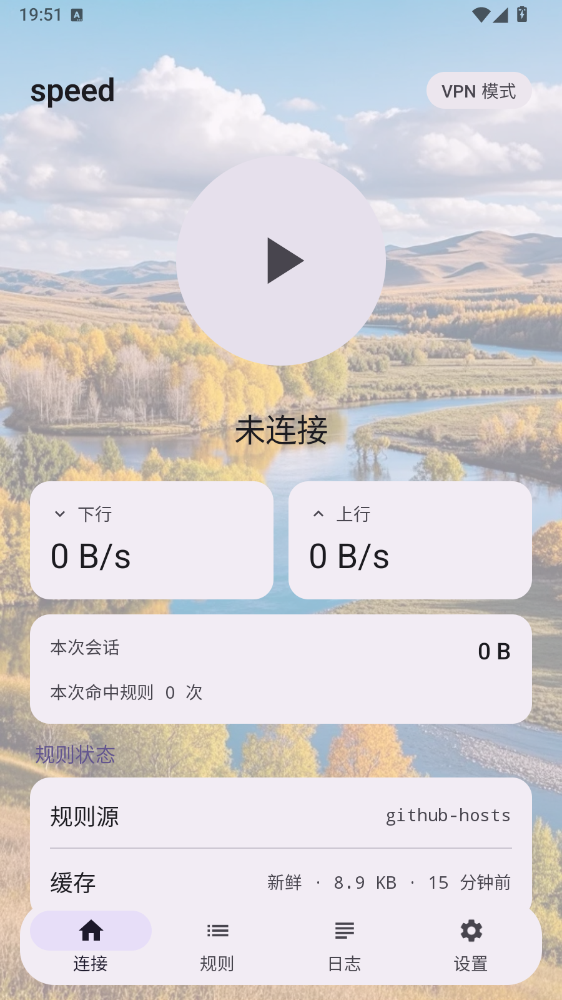
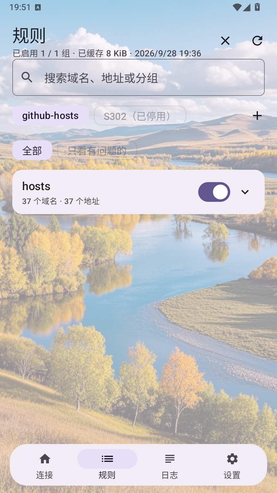
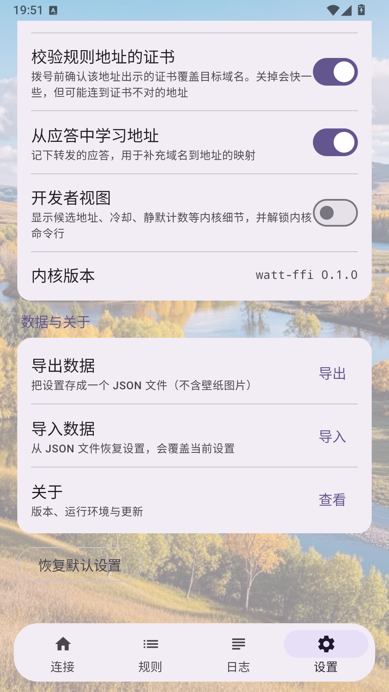

<div align="center">

# speed

**免 Root 的 Android 网络绕行工具**

一份「域名 → 地址」规则表，把命中规则的流量从可达的地址拨出去，其余流量原样直连。

[](LICENSE)
[-3ddc84.svg)](#下载)
[](#下载)

</div>

---

## 这是什么

`speed` 是一个 Android 应用（包名 `dev.detour`）。它自带一个**用户态 TCP/IP 协议栈**，
通过系统 `VpnService` 接管整机流量（或只开一个本地 HTTP 代理端口），
对规则表里命中的域名**不再按 DNS 解析结果连接，而是改从规则给出的地址拨号**。

不需要 Root，不需要安装证书，不需要框架。

| 模式 | 接管范围 | 授权 |
| --- | --- | --- |
| **VPN 模式** | 整机全部流量 | 需要一次系统 VPN 授权 |
| **代理模式** | 只对把 HTTP 代理指向 `127.0.0.1:<端口>` 的应用生效 | 不需要 |

默认代理端口 `1080`，可在设置里改。

## 界面

| 连接 | 规则 | 设置 |
| --- | --- | --- |
|  |  |  |

## 特性

### 路由

- **规则驱动**：hosts 形式的「域名 → 地址」表，命中即改道，未命中直连。
- **多候选并行竞速**：一个连接同时拨 `race_width` 个候选地址，先握手成功的胜出，
  不必为一个死地址付满超时。`race_width = 1` 退回逐个串行尝试。
- **证书预检**：拨号前确认该地址出示的证书确实覆盖目标域名——**地址能连不等于地址是它**。
- **失败冷却与排序**：被判失败的候选进冷却并降序；「连上但零字节」单独降序，不写失败记录。
- **DNS 本地应答**：命中规则时内核直接应答，不转发上游。
- **UDP 流表**：满时淘汰最久未用的一条，而不是拒绝新流。

### 规则

- 三级下钻：**分组 → 域名 → 地址**；搜索域名、地址或分组。
- 分组开关、全部开启 / 全部关闭；关掉的规则不会进内核。
- 自定义规则源，默认 `github-hosts`（`maxiaof/github-hosts` 的 hosts 文件）。
  默认源在你的网络下不可达时，在规则页添加自定义源即可。
- 缓存带**来源身份**校验：换了数据源或升级了应用，旧缓存不会被当成新规则复用。

### 观测

- 主页：实时上下行速率、本次会话流量、命中规则次数与命中率、规则缓存新鲜度。
- 日志：实时 / 归档两个页签，按 全部 / 会话 / 错误 / DNS 过滤，支持搜索、复制、导出。
- 开发者视图：候选地址、冷却、静默计数等内核细节。
- **内核命令行**：与 adb 控制面同一套命令（`status`、`set mtu 1400`、`dump`、`help`），
  直接在手机上驱动内核，不必连电脑。

### 数据与外观

- 设置导出 / 导入：一份 JSON 设置文档，导入前二次确认，来自更新版本的文档会被拒绝。
- 玻璃材质两档：**液态玻璃**（折射 + 高光 + 描边，需 Android 13）与**磨砂模糊**；
  支持自定义背景壁纸，玻璃会折射它。
- 主题色、深色模式、圆角、字号。
- 关于页：版本、内核加载状态、运行环境、规则规模、更新检查。

## 设计取舍

**不解密 TLS。** 这是刻意的选择，不是缺失。应用不装证书、不做中间人，因此
「一个域名能不能走通」严格等于两件事同时成立：

1. 规则给出的地址**可达**；
2. 该地址出示的证书**覆盖这个域名**。

第二条是架构边界。规则表里一个地址再快，只要证书不覆盖目标域名就用不了它，只能换地址。
有些 CDN 的边缘证书覆盖范围很宽（例如 Akamai 边缘证书覆盖 `*.akamaihd.net`），
这类域名可以正常走；覆盖范围窄的，就只能靠规则表给出正确的地址。

应用提供「校验规则地址的证书」开关。关掉会快一些，但可能连到证书不对的地址——
那时失败会以 TLS 错误的形式出现在浏览器里，而不是被内核悄悄吞掉。这是有意的：
**宁可让调用方看见一个明确的失败，也不要给它一个看起来成功、实际连错机器的连接。**

**规则质量决定成败。** 这套方案的实际瓶颈是规则表里地址的**正确性**，不是地址的数量。

## 下载

到 [Releases](../../releases) 下载对应 ABI 的 APK：

| 文件 | 适用设备 |
| --- | --- |
| `speed-<版本>-arm64-v8a.apk` | 绝大多数现代手机与平板 |
| `speed-<版本>-x86_64.apk` | 模拟器、少数 x86 平板 |

两个包用**同一个发布密钥**签名。密钥不在仓库里——一个会安装 VPN 的应用，
「谁能签出构建」就是它的信任边界，所以密钥由维护者保管，经仓库 secret 交给 CI。
若签名与你已装的版本不一致，Android 会拒绝覆盖安装；先卸载再装。

最低要求 **Android 8.0（API 26）**。

## 从源码构建

需要：Rust（含 `aarch64-linux-android` 与 `x86_64-linux-android` target）、
Android NDK r30、Android SDK（platform 36 + build-tools 36.0.0）、JDK 17。

```bash
# 1) 编译内核：Rust → .so，落到 android/app/src/main/jniLibs/<abi>/
PROFILE=release bash scripts/app-native-build.sh aarch64-linux-android x86_64-linux-android

# 2) 打包 APK（首次运行会自动下载 Gradle 8.14.3 到 ~/.cache）
SKIP_NATIVE=1 bash scripts/app-build.sh assembleRelease -PabiSplits
```

产物在 `android/app/build/outputs/apk/release/`。只调 UI 时用 `assembleDebug`。

可调环境变量：`NDK_DIR`、`ANDROID_HOME`、`ANDROID_ABI`、`ANDROID_API`、
`CARGO_TARGET_DIR`、`PROFILE`、`SKIP_NATIVE`。

**签名完全由环境驱动，仓库里没有任何密钥。** 设好下面四个变量后 `assembleRelease`
产出已签名包；不设则停在未签名状态——这是刻意的停止点，不是遗漏：

```
WATT_KEYSTORE  WATT_KEYSTORE_PASSWORD  WATT_KEY_ALIAS  WATT_KEY_PASSWORD
```

`-PabiSplits` 同样是可选的。不加它产出单个 universal APK；加上它按 ABI 拆分。
发布用的是拆分包，因为内核每个 ABI 约 1.9 MB，universal 包会带一份设备永远用不到的库。

## 发布流程

[`.github/workflows/release.yml`](.github/workflows/release.yml)：推一个 `v*` 标签即触发。

CI 从源码编 Rust（两个 ABI）→ `assembleRelease -PabiSplits` → 用仓库 secret 里的密钥签名 →
校验签名与包信息 → 把两个 APK 连同 `CHANGELOG.md` 里对应版本的正文一起挂到 GitHub Release。

密钥以 base64 存进四个仓库 secret：`KEYSTORE_BASE64`、`KEYSTORE_PASSWORD`、`KEY_ALIAS`、`KEY_PASSWORD`。

## 目录结构

```
core-rs/            内核（Rust workspace）
  crates/watt-rules   规则文档 → 路由表，含缓存与更新生命周期
  crates/watt-net     TUN 设备
  crates/watt-stack   内核本体：engine / tcp / udp / dns / planner / proxy
  crates/watt-daemon  CLI 驱动
  crates/watt-ffi     C ABI 与 JNI 入口
android/            Android 壳层（Kotlin + Jetpack Compose）
scripts/            构建与测试的全部入口
rules-puller/       独立的 PHP 小工具：定时拉取并聚合规则源
docs/               设计文档与截图
```

## 测试

```bash
scripts/cargo.sh test --workspace                    # 单元测试
scripts/cargo.sh clippy --workspace --all-targets -- -D warnings
bash scripts/tun-smoke.sh                            # 真实 TUN 端到端
bash scripts/tun-stress.sh                           # 长稳
bash scripts/daemon-smoke.sh                         # CLI 驱动
```

一条贯穿全仓库的约定：**网络行为只在设备上测量**。主机不经隧道，`adb shell` 在多数
模拟器上还是 root，而 `VpnService` 按设计排除 root 流量——用主机或 root 身份去测，
得到的是测量方法的错误，不是内核的结论。

## 许可

GNU General Public License v3.0，见 [LICENSE](LICENSE)。

## 致谢

- [BeyondDimension/SteamTools](https://github.com/BeyondDimension/SteamTools)（Watt Toolkit）——
  代理设计的参考。
- [maxiaof/github-hosts](https://github.com/maxiaof/github-hosts) —— 默认规则源。
- [smoltcp](https://github.com/smoltcp-rs/smoltcp) —— 用户态 TCP/IP 协议栈。
- [Kyant0/Backdrop](https://github.com/Kyant0/Backdrop) —— 玻璃材质的背景采样。
