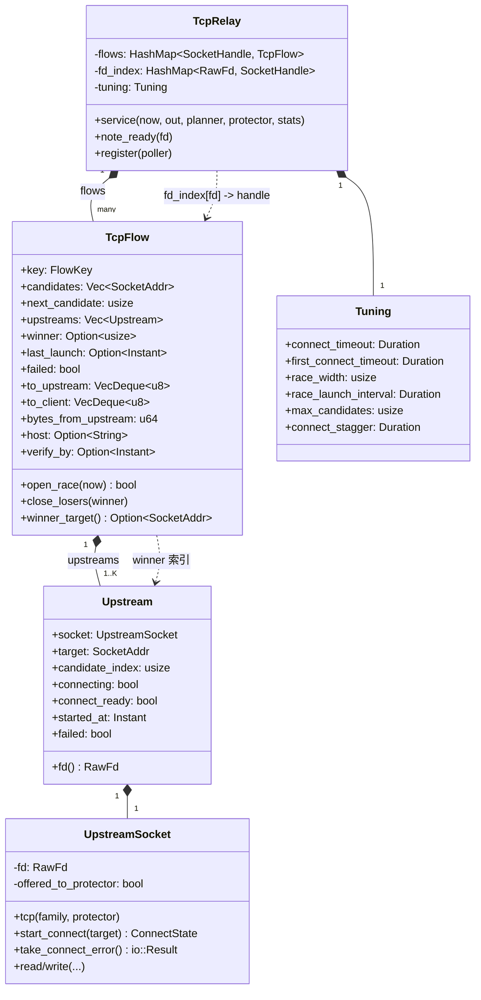
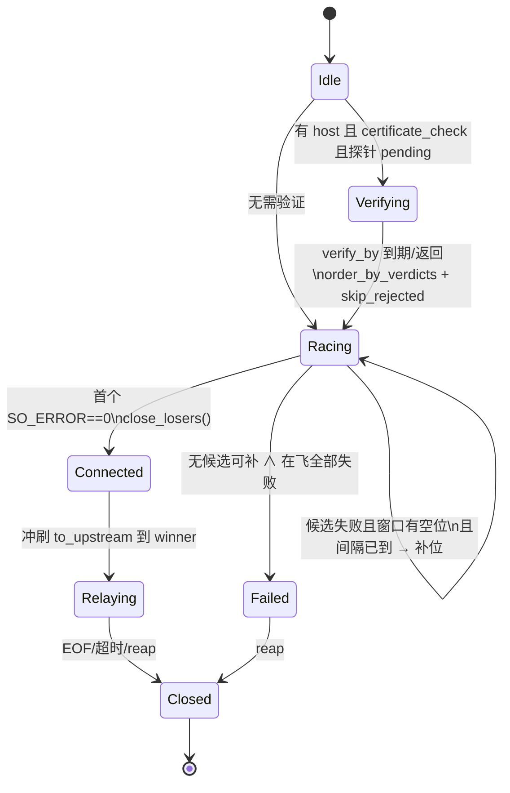
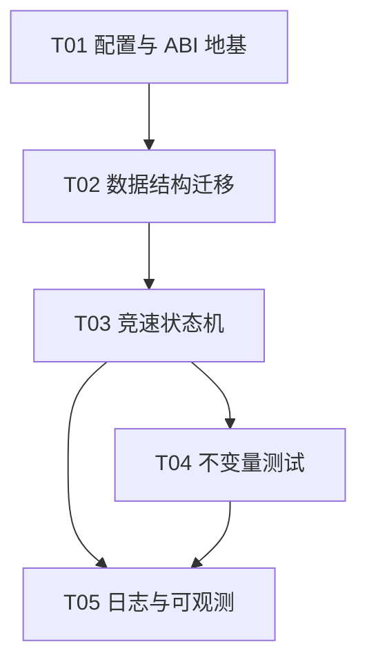

# 内核多候选并行竞速（Happy Eyeballs）设计

> 范围：`core-rs/crates/watt-stack`（relay 内核）+ `core-rs/crates/watt-ffi`（配置 ABI）+ Android 设置项透传。
> 目标：把 `github.com` 冷启动从最坏 ~6 s 压到 ~1 s 量级，且不改变任何对外可观测语义（客户端端口、透明性、健康判定）。
> 本文只做设计与任务分解，不含实现代码；所有接口以签名 / 伪代码形式给出。

---

## 0. 问题定义与现状盘点

### 0.1 症状与根因

`github.com` 规则含 39 个地址，`max_candidates` 截前 8，其中至少 3 个真实可用。实测日志：

```
flow 20.205.243.166 -> 8 candidates, host=Some("github.com")
upstream to Some(20.207.73.82)    died (candidate 0/8)   ← 3s
upstream to Some(20.200.245.247)  died (candidate 1/8)   ← 又一个 3s
upstream connected via 140.82.112.3 (247 ms)             ← 第三个才通
```

根因是 **串行失败转移**：`relay()` 每 tick 只为 `flow.upstream`（单个）推进一次拨号，一个候选死了才 `advance_candidate()` 试下一个，每个死候选都要付一次 `first_connect_timeout`（3 s）。地址池没问题，问题是"一次只等一个"。

### 0.2 现有机制清单（必须协作，不重复设计）

| 机制 | 位置 | 作用 | 与竞速的关系 |
|------|------|------|--------------|
| `TcpFlow.candidates / candidate_index` | `tcp.rs:168/171` | 候选列表与游标 | **改造**：游标拆成"已启动指针"与"已尝试集合" |
| `TcpFlow.upstream: Option<Upstream>` | `tcp.rs:175` | 单个上游连接 | **改造**：`Vec<Upstream>` + `winner` |
| `Upstream { socket, connecting, connect_ready, started_at }` | `tcp.rs:157` | 单个拨号状态 | **扩展**：增加 `target` / `candidate_index` / `failed` |
| `advance_candidate()` | `tcp.rs:374` | 换下一个候选、清空双缓冲 | **语义变化**：改为"关闭败者 + 启动下一批" |
| `has_alternative()` | `tcp.rs:331` | 决定用 3 s 还是 20 s 超时 | **改造**：由"后面还有候选"变为"窗口内还有名额 / 后面还有候选" |
| `skip_rejected()` | `tcp.rs:351` | 跳过判据表已否决的候选 | **保留**，作用于"启动批次"选取阶段 |
| `order_by_verdicts()` | `tcp.rs:300` | 按判据表排序（仅在首拨前生效） | **保留**，竞速前排序 |
| `verify_by` | `tcp.rs:871/923` | 等证书探针结果再拨 | **保留**，作用于整批而非单点 |
| `connect_stagger` | `config.rs:159` | 一次性错峰，防突发 SYN | **改造**为"竞速启动间隔" |
| `fd_index: HashMap<RawFd, SocketHandle>` | `tcp.rs:416` | fd→flow O(1) 反查 | **保留类型**，需支持"多 fd 映射同一 handle" |
| `note_ready(fd)` | `tcp.rs:679` | 置 `connect_ready` | **改造**：按 fd 精确定位到具体 `Upstream` |
| `reap()` | `tcp.rs:1290` | 回收流 + 注销 fd | **改造**：注销全部上游 fd |
| `protect(fd)` 顺序 | `upstream.rs:156` | 上游 socket 手写、connect 前保护 | **不变量，必须保持** |

### 0.3 硬约束（违反即出故障）

1. 每个上游 fd 必须在 `connect` **之前** `VpnService.protect(fd)`；竞速会新增 fd，顺序约束对每个新 fd 都成立。
2. 客户端端口始终保留（`port` 描述"服务在哪个端口"，非重定向目标）。
3. 规则热替换（`Engine::replace_rules`）不打断在跑的流。
4. 每个初始 SYN 必须有自己的 listener（smoltcp 无 socket 接收会回 RST）—— 竞速只动上游侧，不动 listener 侧。
5. 数据面不得阻塞：`relay()` 是纯轮询状态机，不能 sleep、不能阻塞等待。

---

## Part A：系统设计

## 1. 并发模型

### 1.1 方案选型

采用 **RFC 8305 Happy Eyeballs 的"滑动窗口并行"变体**：

- 同时最多 `race_width`（记作 **K**）个候选处于"拨号中"。
- 拨号启动受 `race_launch_interval` 节流（错峰），既压住 SYN 突发，又让窗口尽快铺满。
- 任一候选 `SO_ERROR == 0` 即 **首个成功者胜出**，其余在飞候选立即关闭。
- 某个候选失败 → 若窗口有空位且仍有未尝试候选 → 立即补位启动下一个。
- 窗口耗尽且全部失败 → 流 `failed`。

> **为什么不是"全并发"**：8 个候选全发 SYN，对中间盒就是一次小型洪泛（现有 `connect_stagger` 的注释已记录过这个教训）。滑动窗口在"覆盖死候选"和"SYN 数量"之间取平衡。

### 1.2 K 的取值依据

`github.com` 的实测分布：8 个候选中前 2 个死、第 3 个活。要覆盖"前 2 死"，窗口至少 3；再大只是徒增 SYN 与 fd。

| K | 覆盖死候选数 | 每流并发 SYN | 首胜最坏等待（含 250ms 错峰） | 评价 |
|---|--------------|--------------|-------------------------------|------|
| 1 | 0（=现状） | 1 | N×3 s | 串行，就是被修的 bug |
| 2 | 1 | 2 | ~250ms + 2×间隔 + RTT | 仍可能在"前 2 死"时多付一轮 |
| **3** | **2** | **3** | **~500ms + RTT** | **默认**：覆盖 github 实测分布 |
| 4 | 3 | 4 | ~750ms + RTT | 收益递减，SYN/fd 继续涨 |

**结论：默认 `race_width = 3`。** 上界 `clamp(1, 4)`（4 以上对移动网络无实测收益）。`race_width = 1` 必须**逐字退化为现有串行行为**，作为一键回退开关。

### 1.3 何时启动后续批次：stagger，不是全并发

启动规则（每 tick 在 `relay()` 内推进，无 sleep）：

```
可启动 ⇔ 在飞候选数 < K
       ∧ next_candidate < candidates.len()
       ∧ (last_launch 为空 ∨ now - last_launch ≥ race_launch_interval)
       ∧ verify_by 已过（首批）
```

- **首批**：由 `verify_by` 门控（等待证书探针），探针到期或返回后一次性排序、`skip_rejected`，然后按窗口铺开。
- **后续补位**：某候选失败释放名额后，**若距上次启动 ≥ `race_launch_interval`** 才启动下一个，否则等下一 tick。这样即使 3 个候选同一 tick 失败，SYN 仍被拉成 ~间隔的节奏。
- `race_launch_interval` 默认 **150 ms**（比现有 `connect_stagger` 的 250 ms 略短：现在它是"整流的首拨延迟"，竞速下它只是"同批候选之间的间距"，且单流最多只多等 2×间隔）。

### 1.4 `first_connect_timeout` 的重新定义

**它不再决定客户端感知的失败转移速度**——竞速下失败转移已经是并行的。它现在的角色是"**窗口轮换的节拍器**"：

| 场景 | 旧语义 | 新语义 |
|------|--------|--------|
| 候选失败判定 | 有替代→3 s，无替代→20 s | **窗口内仍有可补位候选 → `candidate_timeout`（3 s）** |
| 最后一搏 | 无替代→20 s | **窗口内已无候选可补（只剩在飞的这些）→ `final_timeout`（= `connect_timeout` 20 s）** |

关键性质保留：**一个"慢但诚实"的服务器仍能拿到完整预算**——只要窗口里不再有可补位的候选，就切回 `connect_timeout`。区别是：旧的"3 s"惩罚是**串行叠加**在客户端预算上的；新的"3 s"只用于**轮换窗口**，客户端的首个成功等待是"最先进候选的 RTT + 错峰间隔×序号"，与死候选数量解耦。

`config.rs` 字段处理：

- **保留** `first_connect_timeout`（改名注释为"窗口内单候选耐心"），避免 ABI/设置项破坏。
  「单候选」指**窗口内只剩在飞的候选可等**，不是**规则里只有一个地址**——后者在 `/1` 上已近乎不存在（2026-09-26 实测 5225 域名 / 15952 地址，几乎无单地址域名），前者靠运行时剪枝随时可达，两者无关。
- **新增** `race_width: usize`、`race_launch_interval: Duration`。
- `connect_stagger` **保留字段但语义降级**为"首批启动间隔"（见 §4）。

### 1.5 与"地址池"的关系

`max_candidates`（截断）与 `race_width`（窗口）正交：前者决定"最多试几个"，后者决定"同时试几个"。`github` 场景 `max_candidates=8`、`race_width=3` 不变，即可命中"前 2 死、第 3 活"。

---

## 2. 数据结构改动

### 2.1 类图



### 2.2 字段迁移表

| 结构 | 旧 | 新 | 说明 |
|------|----|----|------|
| `TcpFlow` | `candidate_index: usize` | `next_candidate: usize` | 语义变为"下一个**未启动**的候选下标"，单调递增，保证每候选至多拨一次 |
| `TcpFlow` | `upstream: Option<Upstream>` | `upstreams: Vec<Upstream>` | 在飞窗口（≤K） |
| `TcpFlow` | — | `winner: Option<usize>` | `upstreams` 内的胜者下标；`None` 表示仍在竞速 |
| `TcpFlow` | — | `last_launch: Option<Instant>` | 错峰计时 |
| `TcpFlow` | `stagger_until` / `staggered` | **删除** | 其职责被 `race_launch_interval` + `last_launch` 取代 |
| `Upstream` | `socket, connecting, connect_ready, started_at` | 追加 `target: SocketAddr`、`candidate_index: usize`、`failed: bool` | `connect_ready` 必须**按 fd** 精确落位（见 2.4） |
| `Tuning` | `first_connect_timeout, connect_stagger` | 追加 `race_width, race_launch_interval` | `connect_stagger` 保留但降级 |

`TcpFlowInfo`（对外快照，`tcp.rs:385`）**向后兼容**：`target` 取 `winner_target()`（竞速中取"当前最早启动的在飞候选"），`candidate_index` 取 `next_candidate`，`candidates` 不变。可**新增** `racing: usize`（在飞候选数）供日志/状态页使用。

### 2.3 fd 生命周期与回收（防泄漏是重点）

不变量：**`fd_index` 中的每个 fd 恰好属于某个 `flow.upstreams` 中的某个 `Upstream`；`Upstream` 一旦离开 `upstreams`（被 drop），其 fd 必须先于 drop 从 `fd_index` 移除。**

用两个私有 helper 强制成对，禁止裸改 `fd_index`：

```rust
// 伪代码：唯一允许的登记/注销入口
fn insert_upstream(&mut self, handle: SocketHandle, up: Upstream) {
    self.fd_index.insert(up.socket.raw_fd(), handle);
    self.flows.get_mut(&handle).unwrap().upstreams.push(up);
}

fn remove_upstream(&mut self, handle: SocketHandle, idx: usize) -> Upstream {
    let up = self.flows.get_mut(&handle).unwrap().upstreams.swap_remove(idx);
    self.fd_index.remove(&up.socket.raw_fd());   // 先注销
    up                                            // 再返回，调用方 drop → UpstreamSocket::drop → close(fd)
}
```

- **败者回收**：`close_losers(winner)` 遍历 `upstreams`，对 `idx != winner` 调 `remove_upstream`；`UpstreamSocket::Drop` 自动 `close(fd)`。
- **`swap_remove` 的坑**：会打乱下标，因此 `winner` 与所有"待处理下标"必须在移除前**先解析为 fd 或目标地址**，不能跨 `swap_remove` 持有下标。建议：`close_losers` 先取出 winner 的 fd，再整体 `drain` 非 winner。
- **`note_ready`**：`fd_index[fd] → handle` 后，需在 `upstreams` 中按 fd 定位：

```rust
pub fn note_ready(&mut self, fd: RawFd) {
    let Some(&handle) = self.fd_index.get(&fd) else { return };
    if let Some(flow) = self.flows.get_mut(&handle) {
        if let Some(up) = flow.upstreams.iter_mut().find(|u| u.socket.raw_fd() == fd) {
            up.connect_ready = true;         // 精确落到那个 fd 对应的候选
        }
    }
}
```

- **`reap()`**：流结束/超时/失败时，遍历 `upstreams` 全部 `fd_index.remove`，再 `remove(handle)`；`reset()` 直接 `fd_index.clear()`（现状已如此）。
- **失败但未连接**的候选：`start_connect` 返回 `Err` 时该 `Upstream` 从未入库，socket 直接 drop，无泄漏。

### 2.4 全局 fd 上限保护

竞速把"单流在飞 fd"从 1 抬到 ≤K。极端下 `max_tcp_flows=2048` × K=3 在握手窗口内可达 ~6000 fd，逼近 `RLIMIT_NOFILE`。新增**全局在飞拨号数**上限：

```rust
// TcpRelay 内
dialing: usize,                    // 当前全局在飞拨号数
max_dialing: usize,                // 默认 256，来自 StackConfig
```

`open_race()` 启动新候选前检查 `self.dialing < self.max_dialing`；`remove_upstream` 递减。这样即使 SYN 风暴，fd 也封顶。

---

## 3. 状态机

### 3.1 流级状态



### 3.2 状态转移表

| 当前 | 事件 | 动作 | 下一 |
|------|------|------|------|
| Idle | `verify_by` 未设且 `certificate_check` 有 host 且探针 pending | `verify_by = now + WAIT` | Verifying |
| Verifying | `now ≥ verify_by` | 重读判据：`order_by_verdicts` + `skip_rejected`；铺窗口 | Racing |
| Racing | 窗口有名额 ∧ 有未启动候选 ∧ 间隔到 | `start_connect` + `insert_upstream` | Racing |
| Racing | 某在飞 fd 可写 → `SO_ERROR==0` | 记 `winner`；`close_losers`；`planner.report_success` | Connected |
| Racing | 某在飞候选 `SO_ERROR!=0` 或超时 | 该 `Upstream.failed`；`remove_upstream`；`planner.report_failure` | Racing / Failed |
| Racing | `next_candidate == len` ∧ `upstreams` 空 | `failed=true; socket.abort(); stats.tcp_connect_failures+=1` | Failed |
| Connected | 首字节进 `to_upstream` | 只写 winner socket | Relaying |
| Relaying | `client_eof`/`upstream_eof`/idle | 传播 shutdown/close | Closed |

### 3.3 "首个成功"的判定与收敛

- **判定**：只认 `take_connect_error() == Ok(())`。一个 fd 可写只代表"拨号结束"，`SO_ERROR` 才是裁决（现状已如此）。竞速下对每个在飞候选都要读 `SO_ERROR`。
- **收敛（胜者产生瞬间）**：
  1. 置 `winner`；
  2. `close_losers()`：关闭其余在飞 socket（`UpstreamSocket::Drop` → `close(fd)`），从 `fd_index` 注销；
  3. `planner.report_success(winner_target, rtt, now)`；
  4. 清 `last_launch`，停止补位。
- **在途数据影响**：**竞速期间不向任何上游写客户端字节**。客户端字节继续堆在 `to_upstream`；只有 `winner` 确定后才冲刷。这样"慢候选"即使握手更早完成也不会拿到半包数据——保证"客户端数据只进胜者"。
  - 反向：竞速期间也不读上游字节（尚未有胜者）。`SO_ERROR==0` 到"可读"之间内核缓冲不会丢。
- **败者已有半开连接**：`close(fd)` 会让对端收到 RST/FIN；因为从未写入字节，对端不会有应用层副作用。可接受。

### 3.4 超时判定的落点

```rust
// 伪代码：每 tick 对每个在飞候选
let can_rotate = flow.next_candidate < flow.candidates.len()
              || flow.upstreams.len() > 1;   // 窗口里还有别的在飞
let budget = if can_rotate { tuning.first_connect_timeout }
             else { tuning.connect_timeout };
if now - up.started_at > budget { mark_failed(up); }
```

即：**只要还有"别处可去"（未启动候选，或窗口里还有别的在飞），就用短预算轮换；当它成为唯一希望时，给足 `connect_timeout`。** 这正是旧 `has_alternative()` 的思想，只是把"后面还有一个"推广为"窗口内还有冗余"。

---

## 4. 与既有机制的关系（保留 / 修改 / 删除）

| 机制 | 决定 | 说明 |
|------|------|------|
| `has_alternative()` | **修改** | 重命名为 `can_rotate_window()`，判据见 §3.4；决定短/长预算 |
| `skip_rejected()` | **保留** | 作用于"启动批次"选取：补位前跳过判据表否决的候选；尾部全是否决项时同样"自我撤销"（保留原语义） |
| `order_by_verdicts()` | **保留** | 竞速前排序一次；`verify_by` 到期后再排一次（现状已如此） |
| `connect_stagger` | **降级保留** | 语义变为"首批启动间隔"；实际节流统一由 `race_launch_interval` 承担。为兼容保留字段，映射到 `race_launch_interval`（取较大值） |
| `verify_by` | **保留** | 门控**整批**首批启动，而非单点；到期后重排 + 跳否决 + 铺窗口 |
| `advance_candidate()` | **删除/内联** | 由 `remove_upstream` + `open_race` 取代 |
| `stagger_until` / `staggered` | **删除** | 由 `last_launch` 取代（见 §2.2） |
| `fd_index` | **保留** | 类型不变，语义扩展为"多 fd → 同 handle"，`note_ready` 按 fd 精确定位 |
| `protect()` 顺序 | **不变量** | 每个新 fd 在 `start_connect` 前保护（`UpstreamSocket::tcp` 内保证） |

---

## 5. 语义不变量（竞速后必须仍成立）

| # | 不变量 | 保障方式 |
|---|--------|----------|
| I1 | 每个候选每流**至多拨一次** | `next_candidate` 单调递增，只在此处取候选；`candidates` 不因失败被删 |
| I2 | 客户端端口**不变** | 只改上游侧；listener 与 `flow_key` 不参与竞速 |
| I3 | 客户端字节**只写入胜者** | 竞速期只缓冲；`winner` 确定后才冲刷 |
| I4 | `bytes_from_upstream` **只统计胜者** | 只从 `winner` 的 socket 读；败者未读即关闭 |
| I5 | `Silent`/`Healthy` 仍**按流**判定 | `reap()` 用 `winner_target()` 与 `bytes_from_upstream`（零字节→Silent，>0→Healthy） |
| I6 | `fd_index` 与 `upstreams` **双向一致** | 只经 `insert_upstream`/`remove_upstream` 变更 |
| I7 | 每个上游 fd **connect 前已 protect** | `UpstreamSocket::tcp` 内顺序保证（现有测试 `a_socket_is_protected_before_it_is_connected` 继续钉住） |
| I8 | 数据面**不阻塞** | 竞速是纯状态机，逐 tick 推进；无 sleep、无阻塞等待 |
| I9 | 单流在飞拨号 ≤ K，全局在飞拨号 ≤ `max_dialing` | `open_race()` 名额检查 |
| I10 | `race_width=1` 时**逐字退化**为旧串行行为 | 单元素窗口 + 无补位间隔差 → 与现状等价 |

---

## 6. 风险与降级

| 风险 | 影响 | 缓解 |
|------|------|------|
| SYN 数量 ×K | 中间盒丢包/封禁、耗电 | 默认 K=3；`race_launch_interval≥150ms`；全局 `max_dialing` |
| fd 用量 ×K | 逼近 `RLIMIT_NOFILE` | `max_dialing` 封顶；败者立即回收；`reap` 全量注销 |
| 慢诚实服务器被误杀 | 可用域变不可用 | 成为唯一希望时切 `connect_timeout`（§3.4）；`race_width=1` 回退 |
| 与证书判据竞争 | 竞速先于判据铺开，错拨被否决地址 | 首批仍由 `verify_by` 门控；补位前 `skip_rejected` |
| 多 fd 映射同 handle 的 bug | `note_ready` 置错候选、误判成功 | `note_ready` 按 fd 精确定位（§2.3）；不变量 I6 |

**开关与默认值建议**：

| 配置 | 默认 | 范围 | 说明 |
|------|------|------|------|
| `race_width` | 3 | 1..=4 | 1 = 关闭竞速（回退串行） |
| `race_launch_interval` | 150 ms | 0..=1000 ms | 0 = 首批全并发（不推荐） |
| `first_connect_timeout` | 3 s | 1..=3 s | 窗口轮换预算（保留） |
| `connect_timeout` | 20 s | 1..=120 s | 最后一搏预算（保留） |
| `max_dialing` | 256 | 16..=1024 | 全局在飞拨号上限 |

**设置项透传**（`Prefs.kernelSettingsJson()` → `apply_settings`）：

```
race_width:                 Int    (1..4)
race_launch_milliseconds:   Int    (0..1000)
max_dialing:                Int    (16..1024)
```

---

## 7. 测试策略

现有 `tcp.rs` 测试模块用**固定时钟**驱动 relay（`Harness::now()` 恒为 `epoch + 1ms`），这是竞速测试的基础设施。注意：固定时钟下"间隔已到"永远为真/假的陷阱——沿用现有"间隔只消耗一次、不读时钟比较"的写法（`stagger_until.take()` 的思路），把 `race_launch_interval` 实现为"每 tick 至多启动一个"而非"读时钟比较"，从而在固定时钟下可测。

| 测试 | 钉住的不变量 | 做法 |
|------|--------------|------|
| `race_picks_the_first_live_candidate` | 首胜正确 | 3 个 loopback：2 个黑 hole（bind 后不 accept / 丢弃），1 个立即 accept；断言 winner 是活的那个，且耗时 ≈ 启动间隔而非 2×3 s |
| `race_dials_each_candidate_at_most_once` | I1 | 用 `OrderingProtector` 计数 `protect` 调用 + 记录目标，断言无重复目标 |
| `losers_release_their_fds` | I6 | 竞速后断言 `relay.fd_index.len() == 1`；`reap` 后 == 0 |
| `serial_mode_is_unchanged` | I10 | `race_width=1` 跑既有 `completes_a_handshake_and_relays_payload_both_ways`，逐字节回归 |
| `client_bytes_only_reach_the_winner` | I3 | 竞速期先塞客户端字节；断言只有 winner 的 loopback accept 端收到 |
| `window_rotates_before_client_budget` | §3.4 | 构造"前 K 全死、第 K+1 活"，断言客户端在 `connect_timeout` 内成功 |
| `bytes_from_upstream_counts_winner_only` | I4 | 败者伪造可读数据（不应被读），断言计数只来自 winner |
| `protect_before_connect` | I7 | 复用 `upstream.rs` 既有测试，参数化到 K>1 |

`watt-ffi` 侧：`apply_settings` 的 `race_width` / `race_launch_milliseconds` / `max_dialing` 解析与 clamp 测试（沿用 `lib.rs:1317` 附近的风格）。

---

## Part B：任务分解

### 8. 依赖包

无新增第三方依赖。竞速复用 `libc`（现有）、`smoltcp`（现有）。Rust 侧不引入 `tokio`/`mio`——保持纯轮询模型。

### 9. 文件清单

| 文件 | 改动 |
|------|------|
| `core-rs/crates/watt-stack/src/tcp.rs` | **主改动**：`TcpFlow`/`Upstream` 多上游、竞速状态机、`note_ready`/`reap`/`relay` 改造、`close_losers`、`open_race`、测试 |
| `core-rs/crates/watt-stack/src/config.rs` | 新增 `race_width` / `race_launch_interval` / `max_dialing`；`first_connect_timeout` 注释重写；`connect_stagger` 降级注释 |
| `core-rs/crates/watt-stack/src/race.rs`（**可选新增**） | 若竞速逻辑超过 ~150 行，抽成独立模块：`RaceWindow`（名额/间隔/补位决策）纯函数，便于单测 |
| `core-rs/crates/watt-ffi/src/lib.rs` | `apply_settings` 解析三个新键 + clamp；`first_dial_from` 注释更新 |
| `android/.../core/Prefs.kt` | 新增 `raceWidth` / `raceLaunchMillis` / `maxDialing` 三个设置项 + `kernelSettingsJson()` 输出 |
| `android/.../ui/SettingsScreen.kt` | 高级分组新增 3 行（Stepper/Slider） |
| `android/app/src/main/res/values*/strings.xml` | 新设置项文案 |

### 10. 任务列表（≤5，按依赖排序）

| ID | 任务 | 源文件 | 依赖 | 优先级 |
|----|------|--------|------|--------|
| **T01** | **配置与 ABI 地基**：`config.rs` 三个新字段 + 默认值/clamp；`watt-ffi` `apply_settings` 解析；`Prefs.kt` 三项 + JSON 输出；`SettingsScreen` 三行；strings。**先落地可编译、行为不变（默认 `race_width=1` 或 3 但逻辑未接入）** | `config.rs`, `watt-ffi/src/lib.rs`, `Prefs.kt`, `SettingsScreen.kt`, `strings.xml` | — | P0 |
| **T02** | **数据结构迁移**：`Upstream` 增 `target/candidate_index/failed`；`TcpFlow` 改 `upstreams: Vec` + `winner` + `next_candidate` + `last_launch`；`insert_upstream`/`remove_upstream`；`note_ready` 按 fd 定位；`register`/`reap`/`reset` 适配多上游；`TcpFlowInfo` 兼容。**此任务结束时 `race_width=1` 必须全绿** | `tcp.rs` | T01 | P0 |
| **T03** | **竞速状态机**：`open_race`（窗口/间隔/名额）、`close_losers`、`can_rotate_window`、超时落点、`relay` 主循环接入、`max_dialing` 全局封顶。**开关默认接 `race_width`（默认 3）** | `tcp.rs`, `config.rs`（`max_dialing` 接入）, 可选 `race.rs` | T02 | P0 |
| **T04** | **不变量测试**：§7 表格全部用例（含 `serial_mode_is_unchanged` 回归）；`watt-ffi` 解析测试 | `tcp.rs`（tests）, `watt-ffi/src/lib.rs`（tests） | T03 | P0 |
| **T05** | **日志与状态可观测**：竞速日志（胜者 rtt、败者原因、在飞数）、`TcpFlowInfo.racing`、README 更新开关说明 | `tcp.rs`, `README.md` | T03 | P1 |

### 11. 共享知识

- 上游 socket **一律**经 `UpstreamSocket::tcp/udp` 创建（内部 `protect` 先于 connect）；禁止裸 `socket()`。
- `fd_index` 只经 `insert_upstream`/`remove_upstream` 变更，禁止裸改。
- 时间一律 `Instant`；`smoltcp` 时间戳经 `smol_now()`。
- 计数口径：`bytes_client_to_upstream` / `bytes_upstream_to_client` 只统计胜者流的真实搬运。
- 日志前缀统一 `watt: flow <dst> ...`。

### 12. 任务依赖图



---

## 13. 待明确事项

1. **`race_width` 默认 3 是否对所有网络都最优**：本设计基于 `github.com` 单点实测；移动网络（高丢包）下 K=3 是否比 K=2 更好，需要真机数据。**建议先以默认 3 上线，保留设置项，收一轮真机日志再定**。
2. **`race_launch_interval` 与 `connect_stagger` 的字段合并**：当前建议"保留 `connect_stagger` 字段但映射到 `race_launch_interval`"。若团队更倾向干净，可**弃用 `connect_stagger`**（ABI 层保留解析、内部忽略），需确认。
3. **IPv6 场景**：`github.com` 有 AAAA 记录时，happy eyeballs 通常"v6 先拨、v4 稍后"。本设计把 v4/v6 候选一视同仁地放进同一窗口，**未实现 RFC 8305 的"族优先"**。若目标网络 v6 可用率高，可后续加"族交错"（T02 的候选排序处预留）。
4. **`max_dialing` 默认值**：256 是基于 `max_tcp_flows=2048` 的粗估，需结合目标设备 `RLIMIT_NOFILE` 实测校准。
5. **败者 RST 对中间盒的影响**：竞速会产生"连上又立刻断"的半开连接。若某些中间盒据此降速，需要把"胜者确认后延迟关闭败者"作为可选项——**当前设计为立即关闭**，待真机验证。
