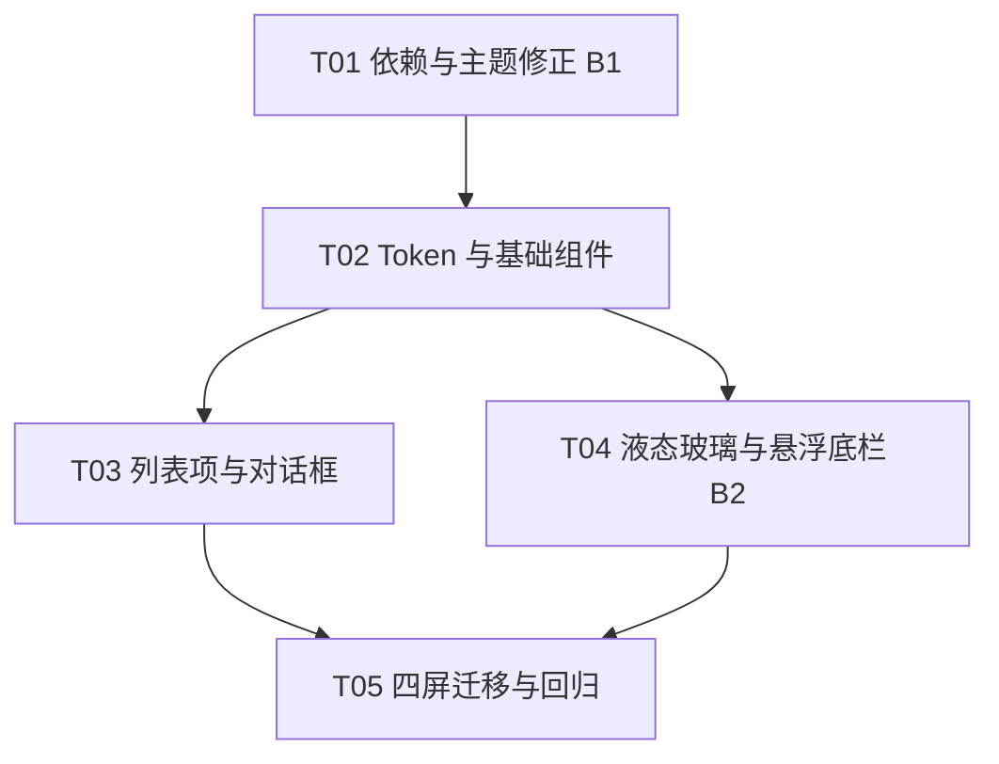

# Android UI 组件库 + 液态玻璃 + 悬浮底栏（Material 3 Expressive）设计

> 范围：`android/app/src/main/java/dev/detour/`（Compose 壳层）。
> 目标：修正两处名实不符；建立统一 token 的组件库；实现液态玻璃与悬浮底栏；四个既有屏幕平滑迁移且功能不减。
> 本文只做设计与任务分解，不含实现代码；接口以签名 / 伪代码形式给出。

---

## 0. 现状盘点

### 0.1 依赖现状

| 项 | 值 | 来源 |
|----|----|------|
| Compose BOM | `2025.12.01` | `app/build.gradle.kts:65` |
| material3 | 由 BOM 决定（未显式 pin） | `app/build.gradle.kts:84` |
| material3 实际解析版 | **1.4.0**（expressive **组件** public；**主题/动效入口 internal**） | 官方版本页 + 编译验证 |
| minSdk / targetSdk / compileSdk | 26 / 36 / 36 | `app/build.gradle.kts:11-19` |
| `gradle/libs.versions.toml` | **不存在** | 目录为空；版本全部内联在 `.kts` |

> **澄清（原判为"注释矛盾"，实为误判）**：`android/build.gradle.kts` 顶部注释称"material3 是 1.4.0"——**这条注释描述的是事实**（实际解析确为 1.4.0），并非与 `app/build.gradle.kts:79-84`（"版本来自 BOM、不显式 pin"）冲突，两者指的是同一结果。`libs.versions.toml` 缺失，版本全部内联在 `.kts`。**真正的问题不在版本，而在可见性**——见 §1.3。

### 0.2 两处名实不符（必须修）

| # | 位置 | 现状 | 问题 |
|---|------|------|------|
| **B1** | `ui/theme/Theme.kt` | 注释（94-100 行）宣称用 `MaterialExpressiveTheme`，但 119 行实际调用 `MaterialTheme` | **MD3E 的 motionScheme 与 expressive 形状集从未生效**；所有"弹簧动效/大圆角"的描述都是注释里的空话 |
| **B2** | `MainActivity.kt` | 24-25 行导入 `ShortNavigationBar` / `ShortNavigationBarItem`，183 行实际用 `NavigationBar` / `NavigationBarItem` | 底栏贴底全宽，**非悬浮**；导入的 expressive 组件从未被使用（编译期浪费 + 误导） |

### 0.3 现有 UI 资产

| 文件 | 内容 | 迁移影响 |
|------|------|----------|
| `MainActivity.kt:165-209` | `Destination` 枚举 + `Scaffold` + `NavigationBar` | 底栏替换（§4） |
| `ui/HomeScreen.kt` | 大按钮、RateCard、SessionCard、ModePicker、ProxyAddressCard、AssistChip | 组件库消费 |
| `ui/RulesScreen.kt` | 三级开关（组/域/地址）+ 搜索 + 来源筛选 + 刷新 | 组件库消费（保留功能） |
| `ui/LogsScreen.kt` | 四筛选（ALL/SESSION/ERROR/DNS）+ 暂停 + 清空 | 组件库消费 |
| `ui/SettingsScreen.kt` | 4 分组、~28 行（Switch/Slider/Stepper/Choice/KeyValue） | **组件库主战场**：`Row2/ToggleRow/StepperRow/SliderRow/ChoiceRow/KeyValueRow` 全部私有重复实现 |
| `ui/theme/Theme.kt` | `FallbackLight/Dark`、`supportsDynamicColor()`、`LocalDynamicColor` | 主题修正 + 接入 expressive |
| `ui/theme/Type.kt` | 等宽数字/宽松行高 | 保留 |

> **核心痛点**：`SettingsScreen.kt` 里 6 个私有行组件（333-476 行）是本项目"各屏幕各写一套"的缩影；`HomeScreen`/`LogsScreen` 又各自手写 `Card`+`CardDefaults.cardColors(surfaceContainerHigh)`。组件库要终结这种重复。

---

## Part A：系统设计

## 1. 先纠正名实不符

### 1.1 B1：`MaterialExpressiveTheme` **不可用**，改手写弹簧

**关键事实（已被编译器证实）**：在 material3 **1.4.0** 下，expressive 的**主题与动效入口是 `internal`**，app 模块引用不了：

```
Cannot access 'MaterialExpressiveTheme': it is internal in file
Cannot access 'MotionScheme': it is internal in file
Cannot access 'ExperimentalMaterial3ExpressiveApi': it is internal in file
```

工程师第一次构建即报 **21 个同类错误**。符号确实存在于 `classes.jar`，但 **`internal` = 模块外不可见**，因此：

- 原设计里 `MaterialExpressiveTheme(...)` 与 `MotionScheme.expressive()` 的代码 **不可实现**；
- **不能**通过换 BOM 绕过——缓存中另一个 BOM `2026.09.00` 的 POM **同样映射到 1.4.0**；
- **不能**显式 `motionScheme`（`MotionScheme` 本身 internal）。

**实际落地方案**：`Theme.kt` **继续用 `MaterialTheme`**（它本就可用、且当前代码已在用），动效改为**手写弹簧**，集中在 `DetourMotion` token：

```kotlin
// Tokens.kt —— 手写弹簧，替代不可用的 MotionScheme.expressive()
val DetourExpressiveSpatial = spring<Float>(
    dampingRatio = 0.8f,
    stiffness = StiffnessMediumLow,
)
val DetourExpressiveFastSpatial = spring<Float>(
    dampingRatio = 0.8f,
    stiffness = StiffnessMedium,
)
val DetourExpressiveEffects = tween<Float>(durationMillis = 200, easing = EaseOut)

// Theme.kt —— 保持 MaterialTheme，不接 expressive 主题入口
@Composable
fun DetourTheme(
    darkTheme: Boolean = isSystemInDarkTheme(),
    dynamicColor: Boolean = true,
    content: @Composable () -> Unit,
) {
    val scheme = /* 现有 Fallback/Dynamic 选择逻辑不变 */
    CompositionLocalProvider(
        LocalDynamicColor provides useDynamic,
        LocalDetourMotion provides DetourMotion(),   // 手写弹簧在此注入
    ) {
        MaterialTheme(
            colorScheme = scheme,
            shapes = DetourShapes,        // 见 §2.2（cornerStyle 档位仍可自建）
            typography = DetourTypography,
            content = content,
        )
    }
}
```

**`MaterialTheme` vs `MaterialExpressiveTheme` 的实际差异**（说明为什么改不了，而不是不想改）：

| 维度 | `MaterialTheme`（可用） | `MaterialExpressiveTheme`（1.4.0 **internal，不可用**） |
|------|-------------------------|--------------------------------------------------------|
| 可见性 | public | **internal**，app 模块无法引用 |
| motionScheme | 无该参数；组件用内置 standard 动效 | `MotionScheme.expressive()`（`MotionScheme` 亦 internal） |
| shapes | 可传自定义 `Shapes` | 可传 expressive 形状集（同为 internal 路径） |
| opt-in 注解 | 无 | `ExperimentalMaterial3ExpressiveApi` 本身 **internal**，无法 `@OptIn` |
| 本项目结论 | **采用** | **弃用**，其能力用 §1.1 手写弹簧 + `DetourShapes` 近似替代 |

> **注意**：`MaterialExpressiveTheme` 的 expressive 形状集同样不可用，因此 `DetourShapes` 必须**自建**（§2.2）。手写弹簧的 `dampingRatio/stiffness` 需在 T01 用真机观感微调，目标是逼近 MD3E 的"有重量"手感。

### 1.2 B2：底栏改用 expressive **组件**（public，可用）

```kotlin
// 签名（material3 1.4.0 中为 public，编译器通过；无需（也无法）@OptIn，
// 因为 opt-in 注解 ExperimentalMaterial3ExpressiveApi 本身是 internal）
@Composable
public fun ShortNavigationBar(
    modifier: Modifier = Modifier,
    containerColor: Color = ShortNavigationBarDefaults.containerColor,
    contentColor: Color = ShortNavigationBarDefaults.contentColor,
    windowInsets: WindowInsets = ShortNavigationBarDefaults.windowInsets,
    arrangement: ShortNavigationBarArrangement = ShortNavigationBarDefaults.arrangement,
    content: @Composable () -> Unit,
)

@Composable
public fun ShortNavigationBarItem(
    selected: Boolean,
    onClick: () -> Unit,
    icon: @Composable () -> Unit,
    label: @Composable (() -> Unit)?,
    modifier: Modifier = Modifier,
    enabled: Boolean = true,
    iconPosition: NavigationItemIconPosition = NavigationItemIconPosition.Top,
    colors: NavigationItemColors = ShortNavigationBarItemDefaults.colors(),
    interactionSource: MutableInteractionSource? = null,
)
```

`ShortNavigationBar` 是**紧凑型导航栏**（比 `NavigationBar` 更矮、内容更聚焦），是悬浮底栏的天然载体（§4）。

> **可见性结论（本节成立的关键）**：expressive 的**组件**（`ShortNavigationBar` / `ShortNavigationBarItem`）在 1.4.0 是 **public**，工程师构建通过、编译器未报错；而 expressive 的**主题入口**（`MaterialExpressiveTheme` / `MotionScheme` / `ExperimentalMaterial3ExpressiveApi`）是 **internal**，不可用（§1.1）。**一句话：组件可用，主题入口不可用。** 因此底栏方案成立，主题只能手写替代。

### 1.3 依赖版本前提（已被编译器推翻并修正）

> **修正后的前提**：material3 **1.4.0** 下，`MaterialExpressiveTheme` / `MotionScheme` / `ExperimentalMaterial3ExpressiveApi` **均为 `internal`，app 模块不可用**（首次构建 21 个 `it is internal in file` 错误）。**"解析到 1.4.0 就无需改动、直接使用"这一原假设是错的，已删除。**

**已定决策**：

| 项 | 结论 |
|----|------|
| 是否 pin material3 | **不 pin**。实际解析就是 1.4.0，`build.gradle.kts` 顶部注释描述的是事实；只需**改掉 `app/build.gradle.kts` 里"版本来自 BOM"与顶部"是 1.4.0"的措辞歧义**，让两处一致，不引入 pin |
| 是否换 BOM 绕过 | **否**。缓存中 BOM `2026.09.00` 的 POM **同样映射到 1.4.0**，换 BOM 救不了 |
| 主题入口 | **弃用**，改手写弹簧（§1.1） |
| expressive 组件 | **采用**（public，§1.2） |

> ⚠️ **方法学警告（务必牢记）**：**验证 API 可用性不能只 grep 产物里的符号是否存在**。本次正是先按"符号在 `classes.jar` 里"判定"可用"，结果被编译器推翻——**符号存在 ≠ 可见 ≠ 可调用**。正确做法是**实际编译**，或**查 Kotlin metadata 的可见性（`internal` / `public`）**。`grep` 只能证明"没写错名字"，不能证明"能引用"。

---

## 2. 组件库结构

### 2.1 目录与职责边界

新增 `ui/components/` 与 `ui/theme/` 扩展，全部**无业务逻辑**，只做视觉与交互契约：

```
ui/
  Destination.kt    [移] Destination 枚举（原在 MainActivity 内 private，提为可见）
  theme/
    Theme.kt          [改] 保持 MaterialTheme + DetourShapes + DetourMotion 注入（不接 expressive 主题入口）
    Type.kt           [留] 排版
    Tokens.kt         [新] LocalDetourSpacing / LocalDetourMotion（手写弹簧）/ LocalDetourGlass
    Shapes.kt         [新] cornerStyle 三档 → Shapes（自建，非 expressive 形状集）
  components/
    DetourCard.kt      卡片：filled / outlined / elevated / glass 四形态
    DetourButton.kt    按钮：filled / tonal / text / icon
    DetourListItem.kt  列表项：ListItem / SectionCard / ToggleRow / StepperRow / SliderRow / ChoiceRow / KeyValueRow
    DetourSwitch.kt    开关：封装（统一拇指/轨道动效，用手写弹簧）
    DetourSlider.kt    滑块：统一数值显示与 onValueChangeFinished 语义
    DetourChip.kt      芯片：FilterChip / AssistChip
    DetourSegmented.kt 分段控件：DetourSegmentedRow（与 ChoiceRow 同形并存）
    DetourDialog.kt    对话框：AlertDialog / 确认框
    LiquidGlass.kt     液态玻璃（纯着色磨砂）：Modifier.liquidGlass + LiquidGlassSurface + 能力降级
    FloatingBar.kt     悬浮底栏：FloatingGlassBar + 4 目的地
```

**职责边界原则**：组件**只接收**状态与回调（`value` + `onChange`），**不读** `Prefs`/`KernelState`。屏幕负责把 `Prefs` 映射为组件参数。这样组件可 `@Preview`、可单测、可复用。

### 2.2 统一 token

```kotlin
// Tokens.kt
data class DetourSpacing(
    val xs: Dp = 4.dp, val sm: Dp = 8.dp, val md: Dp = 12.dp,
    val lg: Dp = 16.dp, val xl: Dp = 24.dp, val screenH: Dp = 20.dp,
)
val LocalDetourSpacing = staticCompositionLocalOf { DetourSpacing() }

// 动效：手写弹簧 —— 替代不可用的 MotionScheme.expressive()（见 §1.1）
data class DetourMotion(
    val spatial: FiniteAnimationSpec<Float> = spring(dampingRatio = 0.8f, stiffness = StiffnessMediumLow),
    val fastSpatial: FiniteAnimationSpec<Float> = spring(dampingRatio = 0.8f, stiffness = StiffnessMedium),
    val effects: FiniteAnimationSpec<Float> = tween(durationMillis = 200, easing = EaseOut),
)
val LocalDetourMotion = staticCompositionLocalOf { DetourMotion() }

// 玻璃：纯着色「磨砂」，无真模糊（见 §3）
data class DetourGlass(
    val level: GlassLevel,         // auto / off / low / high（见 §3.3）
    val tint: Color,               // 半透明容器色（α≈0.72）
    val borderWidth: Dp = 1.dp,
    val highlightAlpha: Float,     // 顶部高光
)
val LocalDetourGlass = staticCompositionLocalOf { DetourGlass.Disabled }
```

**形状**（`Shapes.kt`）：`cornerStyle` 设置（`small/medium/large`）映射到 `Shapes` 各档，注入 `MaterialTheme(shapes = ...)`。**expressive 形状集不可用（§1.1），故此处为自建**；`large` 档用更大的圆角值近似 MD3E 观感。

**颜色**：不新增 token，直接用 `MaterialTheme.colorScheme`（含 expressive 角色如 `surfaceContainerHigh`）；组件内部统一取色，避免屏幕各写一套。

### 2.3 组件清单与现状映射

| 组件 | 替换现有 | 关键签名 |
|------|----------|----------|
| `DetourSectionCard(title, content)` | `SettingsScreen.SectionCard`(334) | 带标题的分组卡 |
| `DetourToggleRow(label, hint, checked, enabled, onChange)` | `SettingsScreen.ToggleRow`(383) | 开关行 |
| `DetourStepperRow(label, value, hint, onDecrease, onIncrease)` | `SettingsScreen.StepperRow`(396) | ± 步进行 |
| `DetourSliderRow(label, value, range, display, onChange)` | `SettingsScreen.SliderRow`(416) | 保留"`remember(value)` 键控"修复 |
| `DetourChoiceRow(label, options, selected, onSelect)` | `SettingsScreen.ChoiceRow`(446) | FilterChip 组 |
| `DetourKeyValueRow(label, value)` | `SettingsScreen.KeyValueRow`(468) | 只读键值 |
| `DetourCard(shape, colors, onClick?)` | `HomeScreen`/`LogsScreen` 各处裸 `Card` | 四形态 |
| `DetourFilterChip` / `DetourAssistChip` | `RulesScreen`/`LogsScreen`/`HomeScreen` | 统一 |
| `DetourSwitch` / `DetourSlider` | 各处 | 统一手写弹簧动效 |
| `DetourSegmentedRow(label, options, selected, onSelect)` | 新增（与 `DetourChoiceRow` **并存**） | 分段控件；带 label+padding，与 `ChoiceRow` 同形可互换 |
| `DetourAlertDialog(...)` | `HomeScreen.ModePicker`(342) | 统一对话框 |

---

## 3. 液态玻璃实现路径

### 3.1 路线取舍与最终决定

| 路线 | 机制 | API 要求 | 能否"模糊背后内容" | 结论 |
|------|------|----------|--------------------|------|
| A. `Modifier.blur(radius)` | RenderEffect | **API 31+**；<31 静默无效 | ❌ 模糊的是**自身图层内容**，非背后 | 不足以做玻璃 |
| B. `Modifier.graphicsLayer { renderEffect = BlurEffect(...) }` | RenderEffect | **API 31+** | ❌ 同上 | 同上 |
| C. Haze 类库（`dev.chrisbanes.haze`） | `hazeSource` + `hazeEffect` 折射 | API 31+ 真模糊 | ✅ | **不引入**（见下） |
| D. **纯着色「磨砂」**（无库） | 半透明容器 + 渐变描边 + 内高光 | 全 API | ❌（视觉近似） | **采用** |

> **关键事实**：`Modifier.blur` **不能**模糊"位于其下方/背后"的内容——它作用于调用者自身图层的渲染结果。Compose 没有内建的"backdrop blur"；要真正折射背后像素，必须走 Haze 这类"抓取背景图层再模糊"的方案。

**最终决定：不引入任何第三方库，玻璃为纯着色「磨砂」，无真折射。** 理由三条：

1. **供应链面**：本项目是网络隐私类应用，引入第三方渲染库扩大依赖与审计面；
2. **API 26 必须回退**：真模糊需 API 31+，回退分支无论如何都要写；
3. **测试机是低配**（模拟器 2 核 / 2GB），真模糊是负收益。

玻璃能力**藏在 `DetourGlass` token 后面**——将来若要加真模糊，只补一层实现，不改任何调用方（§3.4）。

### 3.2 视觉构成（纯着色「磨砂」）

玻璃观感由三层叠加构成，**无背景折射**：

```
┌─────────────────────────────────────────────┐
│  ① 磨砂底：半透明容器色（α≈0.72）              │
│  ② 高光描边：1dp 渐变 border                  │
│     顶部亮（白 α≈0.5）→ 底部暗（白 α≈0.05）     │
│  ③ 镜面高光：顶部 radial/linear 渐变叠加 α≈0.12 │
└─────────────────────────────────────────────┘
```

伪代码（`LiquidGlass.kt`）：

```kotlin
fun Modifier.liquidGlass(
    shape: Shape,
    glass: DetourGlass,
): Modifier = composed {
    this
      .clip(shape)
      .background(glass.tint)                                   // ① 磨砂底
      .border(glass.borderWidth, specularBrush(shape), shape)   // ② 渐变高光描边
      .drawWithContent {                                        // ③ 顶部镜面高光
          drawContent()
          drawSpecularHighlight(glass.highlightAlpha)
      }
}
```

### 3.3 玻璃档位与能力降级

`GlassLevel` 四档（`auto / off / low / high`），**全部为纯着色**，区别只在磨砂底不透明度与高光强度：

| level | 磨砂底 tint α | 高光 | 适用 |
|-------|---------------|------|------|
| `off` | 不透明 `surfaceContainer` | 无 | 关闭玻璃 |
| `low` | ≈0.85 | 弱 | 低配 / 省电 |
| `high` | ≈0.72 | 强（描边 + 镜面） | 高配默认观感 |
| `auto` | 运行时解析：低配 → `low`，否则 → `high` | — | **默认** |

**低内存判定**（模拟器 2 核 / 2GB 必然命中）：

```kotlin
fun isLowEnd(context: Context): Boolean {
    val am = context.getSystemService(ActivityManager::class.java)
    return (am?.isLowRamDevice == true) || Runtime.getRuntime().availableProcessors() <= 4
}
```

**性能代价与缓解**（模拟器 2 核 / 2GB 是硬约束）：

| 代价 | 缓解 |
|------|------|
| 每帧额外绘制（渐变描边 + 高光叠加），GPU 负载上升 | 档位越低越简化；`off` 直接不绘制 |
| 多层玻璃叠加（底栏 + 卡片）开销累积 | **同一屏最多一层玻璃**（通常只给底栏），卡片一律用普通 `DetourCard` |
| 动画期间重算渐变 | 动画期间用静态高光，不做实时重绘 |

**设置项**：`glassEffect`（`auto / off / low / high`），**默认 `auto`**（低配关到 `low`、否则 `high`）。作为组件库能力开关，避免用户无法关闭耗电特性。

### 3.4 能力封装与未来扩展点

- `LiquidGlass.kt` **只依赖 `DetourGlass` token**，不依赖任何模糊 API，也不依赖任何第三方库。
- 视觉规格：容器 `tint = colorScheme.surfaceContainer.copy(alpha = glass.alpha)`，描边渐变、顶部高光按 `GlassLevel` 强度绘制——**"磨砂"观感成立，无折射**。
- 保证：**任何 API 26+ 设备上，`FloatingGlassBar` 与 `DetourCard(glass)` 都可渲染**，不崩溃、不空白。
- **扩展点**：将来若决定引入真模糊，只需在 `LiquidGlass.kt` **内部**按 `GlassLevel` 叠加一层实现，**调用方与 token 均不变**。

---

## 4. 悬浮底栏

### 4.1 形态

替换 `MainActivity.kt:183` 的 `NavigationBar`：

```kotlin
// 无需 @OptIn：expressive 组件是 public，且 opt-in 注解本身 internal 无法引用（§1.2）
@Composable
fun FloatingGlassBar(
    destinations: List<Destination>,
    selected: Int,
    onSelect: (Int) -> Unit,
    modifier: Modifier = Modifier,
) {
    val glass = LocalDetourGlass.current
    val shape = RoundedCornerShape(28.dp)             // MD3E 大圆角
    ShortNavigationBar(
        modifier = modifier
            .fillMaxWidth()
            .padding(horizontal = 16.dp, vertical = 12.dp)   // 外边距 → 悬浮感
            .windowInsetsPadding(WindowInsets.navigationBars) // 避让系统手势条
            .liquidGlass(shape, glass),                       // 纯着色磨砂
        containerColor = Color.Transparent,           // 玻璃自绘，不叠加默认底
        contentColor = MaterialTheme.colorScheme.onSurface,
    ) {
        destinations.forEachIndexed { i, d ->
            ShortNavigationBarItem(
                selected = selected == i,
                onClick = { onSelect(i) },
                icon = { Icon(d.icon, contentDescription = null) },
                label = { Text(stringResource(d.labelRes)) },
            )
        }
    }
}
```

**形态规格**：

| 属性 | 值 | 依据 |
|------|----|------|
| 外边距 | 左右 16dp，底 12dp | 悬浮分离感 |
| 圆角 | 28dp | MD3E 大圆角 |
| 玻璃质感 | §3.2 三层（纯着色磨砂，无折射） | 液态玻璃观感 |
| 阴影 | 关闭默认 elevation，用玻璃高光替代 | 避免"贴底卡片"观感 |
| 系统 inset | `windowInsetsPadding(navigationBars)` | 手势条避让 |
| 目的地 | 4（连接/规则/日志/设置） | `Destination.entries`（已移至 `ui/Destination.kt`） |

### 4.2 `Scaffold` inset 与内容避让

悬浮底栏**脱离贴底**后，`Scaffold` 的默认 `innerPadding` 不再等于"内容需避让的高度"。处理：

```kotlin
Scaffold(
    bottomBar = { FloatingGlassBar(...) },
    // 让 Scaffold 知道底栏浮起的高度：内容 bottom padding = innerPadding + 底栏高度 + 上下外边距
) { inner ->
    Surface(
        modifier = Modifier
            .fillMaxSize()
            .padding(inner)                       // inner.bottom 已含 bottomBar 测量高度
            .padding(bottom = 0.dp),              // 底栏已自带 vertical padding
        color = MaterialTheme.colorScheme.surface,
    ) { /* 四屏 */ }
}
```

要点：

- `ShortNavigationBar` 自带高度与内部 padding；`Scaffold` 的 `bottomBar` 槽会把它计入 `innerPadding`。**外加的 12dp 底边距在 `FloatingGlassBar` 内部**，因此 `inner.bottom` 已包含"悬浮间隙"。
- 若出现内容被底栏遮挡（滚动列表最后一项），在列表 `contentPadding.bottom` 追加 `LocalDetourSpacing.xl`。
- **edge-to-edge**（`enableEdgeToEdge()` 已在用）：底栏必须自行 `windowInsetsPadding(navigationBars)`，否则会被手势条压住。

### 4.3 选中态动效

- 选中项动效由 `ShortNavigationBarItem` **内部实现**提供（指示器形变、图标位移），使用库自带动效参数，**不受本项目主题影响**——因为 expressive 的 `MotionScheme` 不可注入（§1.1）。
- **不额外手写** `animateFloatAsState` 去覆盖它：库内动效已足够，手写反而与组件不同步。
- 组件库层**我们可控**的动效（`DetourSwitch` / `DetourSlider` / 卡片按压等）一律走 `LocalDetourMotion`（手写弹簧，§2.2）。
- 标签切换（`selected` 变化）由组件内部处理，无需屏幕层干预。

### 4.4 兼容 4 个目的地

`ShortNavigationBar` 对 3-5 项均适用；4 项（连接/规则/日志/设置）直接 `Destination.entries.forEachIndexed`。选中索引继续用 `rememberSaveable { mutableIntStateOf(0) }`（保留旋转恢复）。

---

## 5. 迁移策略

**总原则：先修主题（B1），再建库，再换底栏（B2），最后逐屏替换。每步可独立编译运行、可回滚。**

### 阶段 0：依赖与主题（T01/T02）

1. 确认 material3 解析版本（§1.3）；**不 pin**，只统一两处 `.kts` 的措辞。
2. `Theme.kt` **保持 `MaterialTheme`**（expressive 主题入口 internal 不可用，§1.1）；注入 `DetourMotion`（手写弹簧）与自建 `DetourShapes`。
3. **验收**：App 可启动，观感变化（动效变弹簧、圆角按 `cornerStyle` 变化），功能零变化。

### 阶段 1：组件库落地（T03）

4. 新建 `Tokens.kt` / `Shapes.kt` / `components/*`。
5. 每个组件带 `@Preview`（含 light/dark、动态色开关、玻璃档位 off/low/high）。
6. **验收**：组件可独立预览，不接任何屏幕。

### 阶段 2：底栏（T04）

7. `FloatingGlassBar` 替换 `NavigationBar`；`Scaffold` inset 按 §4.2 调整。
8. 把 `MainActivity` 中原本**导入但未使用**的 `ShortNavigationBar*` 真正用起来（B2 修完）。
9. **验收**：四屏可切换；内容不被遮挡；旋转保留 tab。

### 阶段 3：逐屏迁移（T04/T05）

| 屏幕 | 迁移内容 | **不得破坏的功能（回归清单）** |
|------|----------|-------------------------------|
| `SettingsScreen` | 6 个私有行组件 → `Detour*Row`；`SectionCard` → `DetourSectionCard` | 4 分组、~28 行设置全部可读可写；`SliderRow` 的 `remember(value)` 键控；`ruleSource` 变更触发 `reloadRulesIfRunning()` |
| `RulesScreen` | `FilterChip`→`DetourFilterChip`；`Card`→`DetourCard`；开关→`DetourSwitch` | **三级开关**（组/域/地址）`applySwitch` 语义；搜索过滤；来源三选一 + 刷新；全开/全关按钮 |
| `LogsScreen` | `FilterChip`→`DetourFilterChip`；`Card`→`DetourCard` | **四筛选**（ALL/SESSION/ERROR/DNS）；暂停冻结；清空；`itemsIndexed` 位置键（防重复键崩溃） |
| `HomeScreen` | `Card`→`DetourCard`；`AssistChip`→`DetourAssistChip`；`AlertDialog`→`DetourAlertDialog` | 模式选择 + 持久化；代理地址复制；速率轮询；开发者视图；`PowerControl` 二进制状态 |

**迁移不变式**：

- 组件库**不改变**任何 `Prefs` 键、`KernelState` 字段或服务调用。
- 屏幕仍是唯一读 `Prefs`/`KernelState` 的地方。
- `LogsScreen` 的 `key = { position, _ -> position }` 与 `SliderRow` 的 `remember(value)` 是**踩坑修复**，迁移时必须原样保留（否则重现"重复键崩溃""滑块回跳"）。

---

## Part B：任务分解

### 6. 依赖包

| 包 | 版本 | 用途 | 必需性 |
|----|------|------|--------|
| `androidx.compose.material3:material3` | 1.4.0（来自 BOM，**不 pin**） | expressive **组件**（`ShortNavigationBar*`）；主题入口 internal 不可用（§1.1） | **必需** |
| `androidx.compose.material3:material3-window-size-class` | 现有 | 已用 | 保留 |
| `androidx.compose.material:material-icons-core` | 1.7.8 | 现有图标 | 保留 |

> **不引入任何第三方库**（尤其 Haze）。玻璃为纯着色磨砂（§3.1）。`build.gradle.kts` **无需新增依赖**，只需消除两处 `.kts` 的措辞歧义（§1.3）。

### 7. 文件清单

| 文件 | 类型 | 改动 |
|------|------|------|
| `android/build.gradle.kts` | 改 | 统一措辞：描述"解析为 1.4.0"这一**事实**，非"pin" |
| `android/app/build.gradle.kts` | 改 | 统一措辞；**不新增依赖**（不引入 Haze，不 pin） |
| `ui/Destination.kt` | 新（移） | `Destination` 枚举从 `MainActivity` 提为可见（B5） |
| `ui/theme/Theme.kt` | 改 | **保持 `MaterialTheme`** + 注入 `DetourMotion`（手写弹簧）/ `DetourShapes`（B1） |
| `ui/theme/Tokens.kt` | 新 | `DetourSpacing` / `DetourMotion` / `DetourGlass` |
| `ui/theme/Shapes.kt` | 新 | `cornerStyle` → `Shapes` |
| `ui/components/DetourCard.kt` | 新 | 卡片 |
| `ui/components/DetourButton.kt` | 新 | 按钮 |
| `ui/components/DetourListItem.kt` | 新 | 6 个行组件 + SectionCard |
| `ui/components/DetourSwitch.kt` | 新 | 开关 |
| `ui/components/DetourSlider.kt` | 新 | 滑块 |
| `ui/components/DetourChip.kt` | 新 | 芯片 |
| `ui/components/DetourSegmented.kt` | 新 | 分段控件 |
| `ui/components/DetourDialog.kt` | 新 | 对话框 |
| `ui/components/LiquidGlass.kt` | 新 | 玻璃 + 能力降级 |
| `ui/components/FloatingBar.kt` | 新 | 悬浮底栏 |
| `MainActivity.kt` | 改 | 换 `FloatingGlassBar`（B2）+ inset |
| `ui/SettingsScreen.kt` | 改 | 切组件库 |
| `ui/RulesScreen.kt` | 改 | 切组件库 |
| `ui/LogsScreen.kt` | 改 | 切组件库 |
| `ui/HomeScreen.kt` | 改 | 切组件库 |
| `core/Prefs.kt` | 改 | 新增 `glassEffect`（可选） |
| `res/values*/strings.xml` | 改 | 新文案 |

### 8. 任务列表（≤5，按依赖排序）

| ID | 任务 | 源文件 | 依赖 | 优先级 |
|----|------|--------|------|--------|
| **T01** | **依赖措辞与主题修正（B1）**：统一两处 `.kts` 措辞（**不 pin**）；`Theme.kt` **保持 `MaterialTheme`** + 注入 `DetourMotion`（手写弹簧）+ `DetourShapes`；`cornerStyle` 生效；`Destination` 移至 `ui/Destination.kt`。**验收：App 启动、动效变弹簧、功能零变化** | `app/build.gradle.kts`, `build.gradle.kts`, `Theme.kt`, `Tokens.kt`, `Shapes.kt`, `Destination.kt` | — | P0 |
| **T02** | **基础组件**：`DetourCard` / `DetourButton` / `DetourChip` / `DetourSwitch` / `DetourSlider`；动效取 `LocalDetourMotion`（手写弹簧）；各带 `@Preview` | `components/DetourCard.kt`, `DetourButton.kt`, `DetourChip.kt`, `DetourSwitch.kt`, `DetourSlider.kt` | T01 | P0 |
| **T03** | **列表项与对话框组件**：`DetourListItem.kt`（SectionCard + Toggle/Stepper/Slider/Choice/KeyValue 行）、`DetourSegmented.kt`（`DetourSegmentedRow`，与 `ChoiceRow` 并存）、`DetourDialog.kt` | `components/DetourListItem.kt`, `DetourSegmented.kt`, `DetourDialog.kt` | T02 | P0 |
| **T04** | **纯着色玻璃 + 悬浮底栏（B2）**：`LiquidGlass.kt`（档位 off/low/high/auto、能力降级，**无 Haze**）、`FloatingBar.kt`；`MainActivity` 用 `ShortNavigationBar` 替换 `NavigationBar` 并修 inset；`glassEffect` 设置项 | `components/LiquidGlass.kt`, `FloatingBar.kt`, `MainActivity.kt`, `Prefs.kt`, `strings.xml` | T02 | P0 |
| **T05** | **四屏迁移与回归**：`SettingsScreen`/`RulesScreen`/`LogsScreen`/`HomeScreen` 切组件库；按 §5 回归清单逐屏验收（三级开关、搜索、四筛选、~28 设置项、滑块键控、日志位置键） | `ui/SettingsScreen.kt`, `RulesScreen.kt`, `LogsScreen.kt`, `HomeScreen.kt`, `strings.xml` | T03, T04 | P0 |

### 9. 共享知识

- 组件**无业务逻辑**：只收 `value` + `onChange`，不读 `Prefs`/`KernelState`。
- 颜色一律取 `MaterialTheme.colorScheme`，禁止硬编码 `Color(0xFF...)`（`FallbackLight/Dark` 是唯一例外，属主题层）。
- 动效一律取 `LocalDetourMotion`（**手写弹簧**，替代不可用的 `MotionScheme.expressive()`），禁止裸 `tween(300)`。
- 间距一律取 `LocalDetourSpacing`，禁止魔法数 `16.dp` 散落。
- 玻璃能力一律经 `LocalDetourGlass`（**纯着色磨砂**），组件**不得**直接调 `Modifier.blur`，也不得引入模糊库。
- **不要引用 expressive 主题入口**（`MaterialExpressiveTheme` / `MotionScheme` / `ExperimentalMaterial3ExpressiveApi` 均 internal，不可用）；expressive **组件**（`ShortNavigationBar*`）是 public，可直接使用、无需 `@OptIn`。
- 保留既有踩坑修复：`SliderRow.remember(value)`、`LogsScreen.itemsIndexed(position)`。

### 10. 任务依赖图



---

## 11. 已决事项（原"待明确"，现均有结论）

| # | 事项 | 结论 |
|---|------|------|
| B1 | material3 是否 pin / 两处 `.kts` 注释 | **不 pin**。实际解析即 1.4.0；`build.gradle.kts` 顶部注释描述的是**事实**（非矛盾），只需统一 `app/build.gradle.kts` 的措辞。 |
| B2 | 是否引入 Haze / 真模糊 | **不引入任何第三方库**。玻璃为**纯着色磨砂**，藏在 `DetourGlass` token 后（将来加真模糊只补一层，调用方不变）。 |
| B3 | `glassEffect` 默认值 | `auto / off / low / high`，**默认 `auto`**（低配 → `low`，否则 → `high`）。 |
| B4 | 分段控件 vs `ChoiceRow` | **并存**。分段控件落地为 `DetourSegmentedRow`（带 label+padding，与 `DetourChoiceRow` 同形可互换）。 |
| B5 | `Destination` 枚举可见性 | **已移到 `ui/Destination.kt` 并提为可见**。 |
| B6 | `hazeSource` 包裹背景（原 §11.6） | **作废**。随 B2"不引入 Haze"一并取消，`MainActivity` 布局结构无需为此改动。 |
| B7 | 主题入口 / 显式 `motionScheme` | **做不到**（`MaterialExpressiveTheme`/`MotionScheme`/`ExperimentalMaterial3ExpressiveApi` 在 1.4.0 均 internal）；改为**手写弹簧**（同 §1.1）。 |
